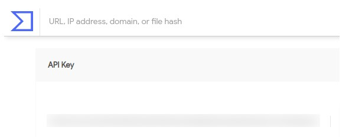
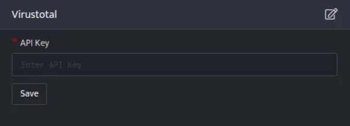

VirusTotal's API lets you upload and scan files, submit and scan URLs, access finished scan reports and make automatic comments on URLs and samples without the need of using the HTML website interface.

## **Real-time updates**

Malware signatures are updated frequently by VirusTotal as they are distributed by antivirus companies, this ensures that our service uses the latest signature sets. As soon as a given contributor blacklists a URL it is immediately reflected in user-facing verdicts.

## **Detailed results**

VirusTotal not only tells you whether a given antivirus solution detected a submitted file as malicious, but also displays each engine's detection label (e.g., I-Worm.Allaple.gen). The same is true for URL scanners, most of which will discriminate between malware sites, phishing sites, suspicious sites, etc. Some engines will provide additional information, stating explicitly whether a given URL belongs to a particular botnet, which brand is targeted by a given phishing site, and so on.

## **Pre-requisites**

- Create an account on VirusTotal to obtain a new API key, sign up link: [https://www.virustotal.com/gui/join-us](https://www.virustotal.com/gui/join-us)

- Obtain your API key by signing in into your account and you will find your public API in the corresponding menu item under your user name.  
    


- The API key is visible as below:  
      
      
    

## **Configuration**

- Follow the initial configuration steps in [How to Configure Automation?](https://dnif.it/kb/uncategorized/configuring-automation/).  
      
      
    

- Click the edit icon to add details.

| **Field**  | **Description** |
| --- | --- |
| API Key | Enter valid API Key |

- Enter above details and click **Save**  
    

## **Lookups integrated with VirusTotal**

  
### **Retrieve URL scan reports**

The URL for which you want to retrieve the most recent report.

### **Function\_name**

```
get_url_report
```

### **Input**

A URL for which VirusTotal will retrieve the most recent report. You may also specify a scan\_id (sha256-timestamp as returned by the URL submission API) to access a specific report.

```
_retrieve query Urldetails
```

Here:

The Urldetails is a custom event store created to demonstrate this example. The \_retrieve directive fetches the $Url field for each event in the Urldetails (custom) eventstore. The output is as shown below:


### **Output**

```
_lookup virustotal get_url_report $Url
```

In the pipelined query function, the \_lookup directive calls the get\_url\_report function of the VirusTotal plugin. $Url is passed as a parameter to the function. This report contains details about the IP address such as the latest URL hosted on it, domain resolved to it, country to which it belongs and so on. The output is as shown below:


The Lookup call returns output in the following structure for available data

| **Fields** | **Type** | **Description** |
| --- | --- | --- |
| $SrcUrl | text | Source Url for lookup |
| $Owner | text | Domain Owner |
| $Country | text | URL Country |
| $Network | text | Network of URL |
| $FullDetails | text | Details of the URL |
| $Reputation | Number | Reputation of Domain |
| $Status | text | Status of the request |

### **Retrieve Domain reports**

The domain for which you want to retrieve the report

### **Function\_name**

```
get_domain_report
```

### **Input**

A domain name

```
_retrieve query DomainDetails
```

Here:

The DomainDetails is a custom event store created to demonstrate this example. The \_retrieve directive fetches the $Domain field for each event in the DomainDetails (custom) eventstore. The output is as shown below:


### **Output**

```
_lookup virustotal get_domain_report $Domain
```

In the pipelined query function, the \_lookup directive calls the get\_domain\_report function of the VirusTotal plugin. $Domain is passed as a parameter to the function. This report contains details about the domain, the source domain, reputation of the domain and so on. The output is as shown below:


The Lookup call returns output in the following structure for available data

| **Field** | Type | **Description** |
| --- | --- | --- |
| $SrcDomain | text | Source Domain |
| $FullDetails | text | Details of the Domain |
| $Reputation | Number | Reputation of Domain |
| $Status | text | Status of the request |

### **Retrieve IP address details**

Retrieve an IP address report

### **Function\_name**

```
get_ip_report
```

### **Input**

A valid IPv4 address in dotted quad notation, for the time being only IPv4 addresses are supported.

```
_fetch $SrcIP from event where $Stream=FIREWALL limit 1
>>_lookup virustotal get_ip_report $SrcIP
```

Here:  
The \_fetch directive retrieves $SrcIP (source IP address) for each event. The result set is limited to the latest event. The output is as shown below:


### **Output**

In the pipelined query function, the \_lookup directive calls the get\_ip\_report function of the VirusTotal plugin. $SrcIP is passed as a parameter to the function. This report contains details about the IP address such as the owner of the IP Address, Network, country to which it belongs and so on. The output is as shown below:


The Lookup call returns output in the following structure for available data

| **Field** | **Type** | **Description** |
| --- | --- | --- |
| $SrcIP | text | Source Ip Address |
| $Owner | text | Owner of IP Address |
| $Network | text | Network of Ip Address |
| $Country | text | IP Address Country |
| $FullDetails | text | Details of the IP |
| $Reputation | Number | Domain Reputation |
| $Status | text | Status of the request |

### **Retrieve file scan reports by MD5/SHA-1/SHA-256 hash**

File report of MD5/SHA-1/SHA-256 hash for which you want to retrieve the most recent antivirus report

### **Function\_name**

```
get_file_report
```

### **Input**

A md5/sha1/sha256 hash will retrieve the most recent report on a given sample.

```
_retrieve query File
```

Here:

The File is a custom event store created to demonstrate this example. The \_retrieve directive fetches the $Filehash field for each event in the File (custom) eventstore. The output is as shown below:


### **Output**

```
_lookup virustotal get_file_report $Filehash
```

In the pipelined query function, the \_lookup directive calls the get\_file\_report function of the VirusTotal plugin. $Filehash is passed as a parameter to the function. This report contains details of the Filehash, File Sha256 Hash, MD5 Sum of the File, and so on. The output is as shown below:


The Lookup call returns output in the following structure for available data

| **Field** | **Type**  | **Description** |
| --- | --- | --- |
| $FileHash | text | File Hash i.e. md5 or sha-256 |
| $Extension | text | Extension of File |
| $Reputation | text | Reputation of File |
| $MD5 | text | MD5 Sum of the File |
| $SHA256 | text | File Sha256 Hash |
| $SHA1 | text | File SHA1 Hash |
| $FullDetails | text | Details of the FileHash |
| $Status | text | Status of the request |
