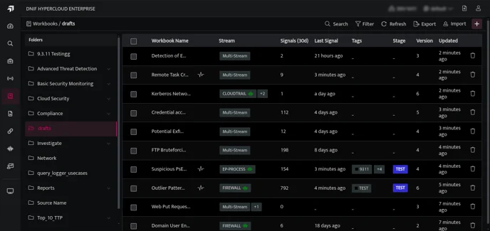

We are happy to introduce new features and enhancements to improve your experience with our platform. Here's what's included in this release:

## **What's New**

- ### **Querying by Source Name (multiple Streams)**  
      
    DQL now offers enhanced querying capabilities with support for filtering by Source Name. Users can leverage DQL queries to investigate events across multiple Streams or against a particular Source Name or a Stream. This added flexibility enables more precise and tailored queries, facilitating deeper insights and more efficient data retrieval. Read more about [Querying by Source Name](/docs/documents/Dnif-Query-Language/Query-by-source-name/query-by-source-name.md) and [Querying multiple Streams.](/docs/documents/Dnif-Query-Language/Query-multiple-streams/query-multiple-streams.md)

    

- ### **Notable events for PICO**  
      
    Tenant administrators can configure email addresses to receive notifications for key events on PICO. When notable events occur, emails will be sent to the designated addresses, enabling administrators to take prompt remedial action. [Know More](/docs/documents/PICO/notification-for-pico-events.md).
  <iframe width="560" height="315" src="https://www.youtube.com/embed/oYqyhKRdH1s?si=y9kcgNZXf_JLLAmJ" title="YouTube video player" frameborder="0" allow="accelerometer; autoplay; clipboard-write; encrypted-media; gyroscope; picture-in-picture; web-share" referrerpolicy="strict-origin-when-cross-origin" allowfullscreen></iframe>   
<!-- https://videopress.com/v/f3h4aWmO?resizeToParent=true&cover=true&preloadContent=metadata&useAverageColor=true -->

- ### **Removal of decommissioned devices from the console**  
      
    Tenant Administrators can now remove inactive devices from the Collection Status page, helping to reduce clutter and improve visibility. [Know More.](/docs/documents/Operations/Collection-Status/collection-status.md)

<figure>
<iframe width="560" height="315" src="https://www.youtube.com/embed/5FCXeQflFVs?si=ogomA8JCa-I6nR3g" title="YouTube video player" frameborder="0" allow="accelerometer; autoplay; clipboard-write; encrypted-media; gyroscope; picture-in-picture; web-share" referrerpolicy="strict-origin-when-cross-origin" allowfullscreen></iframe>   
<!-- https://videopress.com/v/ELNNE2Oh?resizeToParent=true&cover=true&preloadContent=metadata&useAverageColor=true -->

<figcaption>

  

</figcaption>

</figure>

- ### **Signal data export**  
      
    Users can now export Signal data on the Signal listing page for further analysis. [Know More](/docs/documents/Security-Monitoring/Investigating-Signals/signal-data-export.md).
  <iframe width="560" height="315" src="https://www.youtube.com/embed/GKjyZI4XvKI?si=I0o_jsN4-EJsbtwG" title="YouTube video player" frameborder="0" allow="accelerometer; autoplay; clipboard-write; encrypted-media; gyroscope; picture-in-picture; web-share" referrerpolicy="strict-origin-when-cross-origin" allowfullscreen></iframe>   
<!-- https://videopress.com/v/m4k80RHK?resizeToParent=true&cover=true&preloadContent=metadata&useAverageColor=true -->

## **Enhancements**

- ### **Workbook listing page enhancements**  
      
    The Workbook listing page now displays additional details, including the date of the last signal generated and the status of data in the streams linked to the workbooks. This information helps users verify if the workbooks are functioning as expected and can assist in identifying whether signals are not being generated due to a lack of data in the associated streams. [Know more](/docs/documents/Hunting-with-Workbooks/Getting-Started/how-to-view-workbooks-2.md)
.  
      
    // 

- ### **A visual representation of the cyclic calls in workbooks**  
      
    Cyclic calls in workbook chaining are identified and visually represented, highlighting the workbook chain responsible for the cycles.

- ### **Extractor Validator to check for duplicate fields across streams**  
      
    With the ability to query multiple streams and query by source name, it is crucial to maintain consistent naming conventions for identical fields across streams. To ensure this, the Extractor Validator now detects and flags duplicate fields across streams.
  <iframe width="560" height="315" src="https://www.youtube.com/embed/hmOlGKHK35U?si=QhK9X1NfWUzoxbYS" title="YouTube video player" frameborder="0" allow="accelerometer; autoplay; clipboard-write; encrypted-media; gyroscope; picture-in-picture; web-share" referrerpolicy="strict-origin-when-cross-origin" allowfullscreen></iframe>  
<!-- https://videopress.com/v/sUUfIzOu?resizeToParent=true&cover=true&preloadContent=metadata&useAverageColor=true -->

