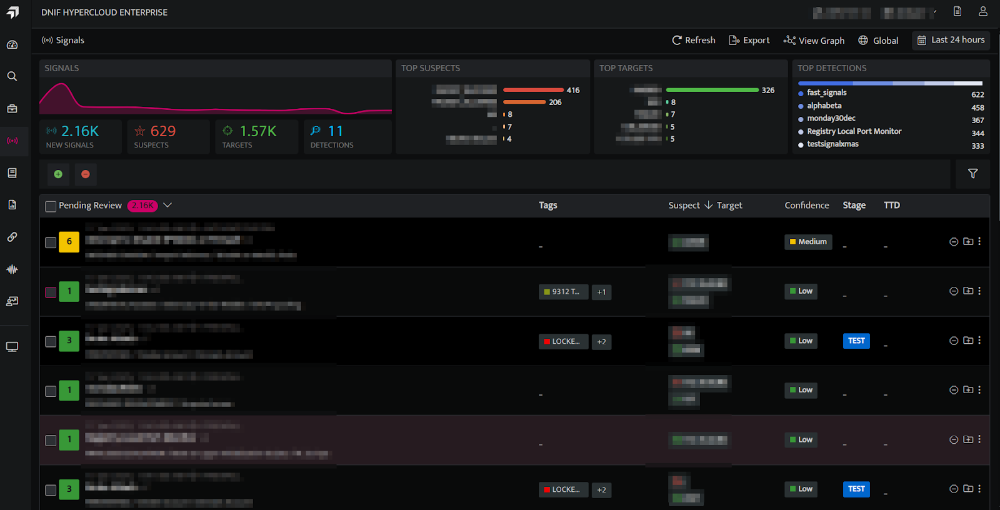
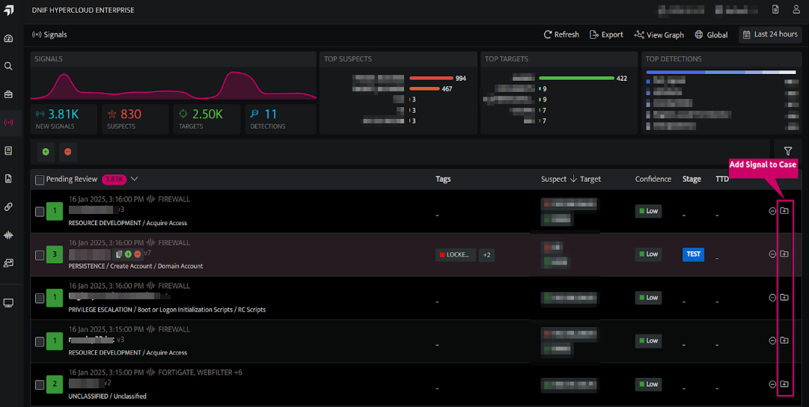
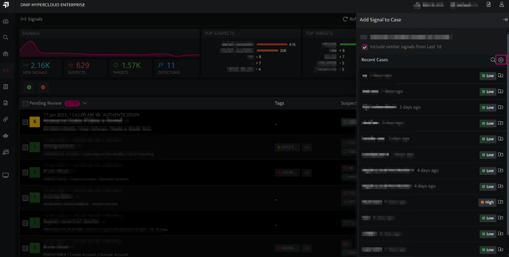
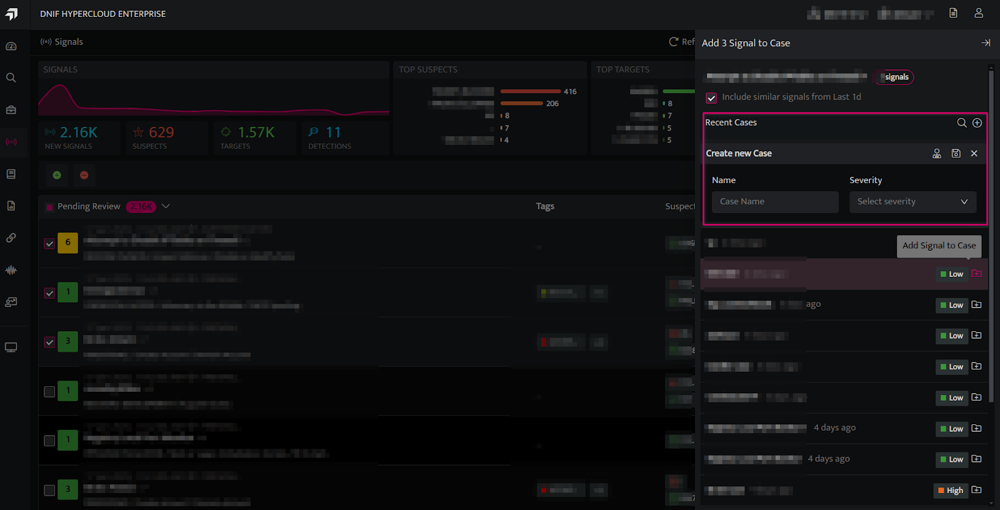
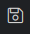
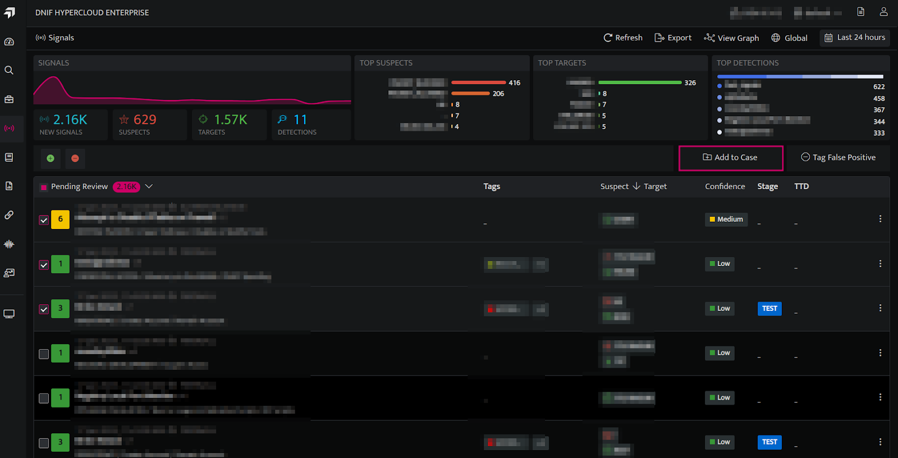
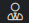

Creating a new case involves adding one or more signals into a case folder. Each case is focused on investigating a particular type of incident. By organizing cases in this manner, the security team can prioritize high-risk incidents, streamline investigations, and accelerate response times.

## **How to create a new case?**  
  

- New cases can be created from the signals listing page by selecting one or more signals.

- Click the **Signals** icon on the left navigation bar of the Home screen, the following screen will be displayed.  
      
      
    

## **Creating a case with one signal**  
  

- Click the icon next to the Signal for which a new case needs to be created.  
      
      
      
      

- On the side panel that appears, Click the **plus** icon shown below to create a new Case.  
      
      
      
    

- The following screen will be displayed.  
      
      
     
      
    

- **Enter the following details:**

| **Fields** | **Description** |
| --- | --- |
| Name  | Enter a case name |
| Severity | Enter a severity level for the signal |
| Handler    | Click and select the handler/user who will investigate the case from the drop-down (optional). |
| Save    | Click to save the case |

- Enter the above details and click **Save**. The new case will be saved and listed.

## **Creating a case with multiple signals**  
  

- Users can select the checkboxes next to the desired Signals, then click **Add to Case** to create a new Case or add them to an existing Case.  
      
      
      
    

- On the side panel that appears, click the **plus** icon to create a new Case.  
      
      
      
    

- The following screen will be displayed  
      
    

| **Fields** | **Description** |
| --- | --- |
| Name |  Enter a case name |
| Severity | Enter a severity level for the signalHandler |
|  | Click and select the handler/user who will investigate the case from the drop-down (optional) |
| Save    | Click to save the case |

- Enter the above details and click **Save**. The new case will be saved and listed.
