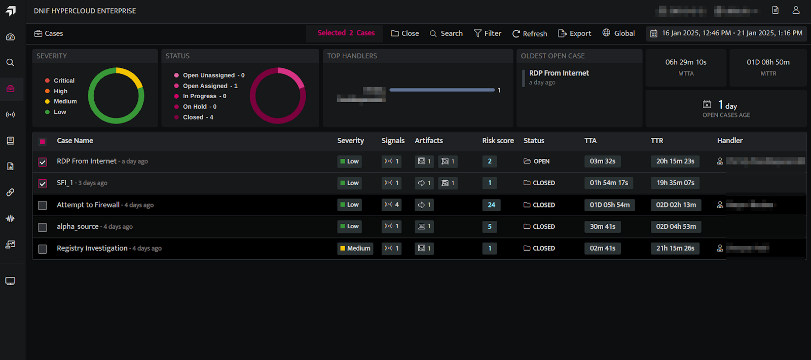

The Export feature simplifies downloading case information, enabling users to access detailed case data and notes for selected cases. The users can perform the following activities:

1. [Export case list](#caselistexport)

3. [Export case data for  selected cases](#caseexportselected)

## **Steps to export case list**

- Click on the **Cases** icon on the left navigation bar of the Home screen to view all the created Cases. By default, it will show cases created within the last 24 hours.  
      
      
      
    

- You may filter the case list based on a specific time frame by using the date time picker and various case attributes by clicking on the filter icon.

- Click the **Export** icon on the Cases page to export the case list.   
      
      
    

| **Fields** | **Description** |
| --- | --- |
| File Name | Displays the name of the file |
| PDF | Export data in PDF format |
| XLSX | Export data in Excel format |
| CSV | Export data in CSV format |
| ZIP | Export data in a ZIP file |
| Select Fields | Select the fields that need to be exported |
| Save | Click Save to confirm your export choice. |

- The case list will be downloaded in the selected format, including the case details, applied filters (if any), and the MTTA and MTTR values.  
      
      
    

## **Steps to export Case Data for selected cases**

- Select the case for which you want to export data, including case notes.  
      
      
      
    

- Click the **Export** icon on the Cases page to export the case list.  
      
    **Note:** The exported cases will be saved as a CSV file, including all case details and notes. Case notes can only be exported in CSV format.
