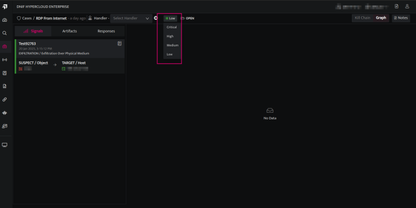

Managing Cases allows users to effectively handle and update existing Cases to ensure smooth workflows and accurate record-keeping. Below are the actions users can perform to manage Cases:

- **Close Multiple Cases** 
    - Click the Cases icon on the left navigation bar of the Home screen.
    
    - Select the cases you want to close and click "**Close**."  
          
          
          
        

- **Add Signals to an Existing Case**
    - On the Signals page, when users select a signal and choose **Add to Case**, a side drawer appears. In the side drawer, click the icon   next to an existing case to add the signal to it.  
          
          
          
          
        

- **Assign or Update the Handler**
    - On the case listing page, click the desired case to view the case details page.
    
    - Users can assign a handler to the case if none is assigned or update the existing handler.  
          
          
          
          
        

- **Change the Status of a Case**
    - Users can update the **status (Open, In-Progress, On-Hold, Close)** of an existing Case within the case details page. [Know more](https://dnif.it/kb/security-monitoring/case-management-security-monitoring/case-lifecycle-2/) about the DNIF Case lifecycle.  
          
          
          
          
        

- **Change the Severity of a Case**
    - Users can update the **severity(Low, Medium, High, Critical)** of an existing Case within the case details page.  
          
          
          
          
        

- **Add Notes to the Case**
    - Users can view the details of actions performed on the case and add detailed notes to it.  
          
          
        
