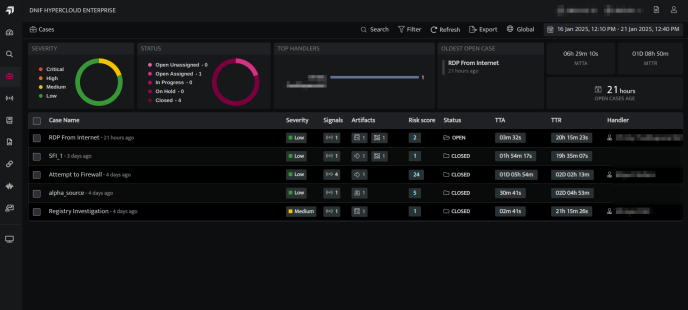
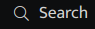
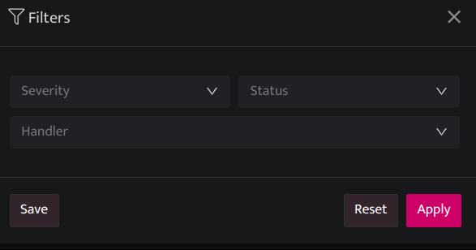
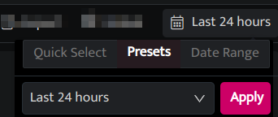

Searching and filtering cases allow users to quickly locate and focus on specific cases by applying relevant filters

## **Search Cases by name**

- On the left navigation bar, Click the **Cases** icon  to view the following page.  
      
      
      
    

- Users can search for existing Cases by the Case name using the **Search**.  
      
      
      
    

## **Filter Cases**  

- On the left navigation bar, Click the **Cases** icon  to view the following page.  
      
      
      
    

- Click the **Filters** icon to apply Filters.  
      
      
      
      
    

| **Fields** | **Description** |
| --- | --- |
| Severity | Users can filter the Case by Severity(low, medium, high, critical) |
| Status | Users can filter the Case by Status(Open, In-Progress, On-Hold and Close) |
| Handler | Users can filter the Case by the Handler name. |
| Apply | Click to apply the filter |
| Reset | Click to reset the filter |
| Save | Click to save the filter |

- Click the **Date Time** picker to filter cases by duration.  
      
      
      
    

- Users can select the following time ranges as per their requirements.
    - **Quick Select:** In this category, you can enter any number and set to retrieve the data for that many minutes/hours or days.
    
    - **Presets**: Lists all the available preset options.
        - **Last 5 minutes:** Displays signals raised during the last 5 minutes.
        
        - **Last 30 minutes:** Displays signals raised during the last 30 minutes.
        
        - **Last 1 hour:** Displays signals raised during the last 1 hour.
        
        - **Last 24 hours (default value):** Displays signals raised during the last 24 hours.
        
        - **Last 7 days:** Displays signals raised during the last 7 days.
        
        - **Last 30 days:** Displays signals raised during the last 30 days.
        
        - **Today**: Displays signals raised today.
        
        - **Yesterday:** Displays signals raised yesterday.
        
        - **Previous Month:** Displays signals raised in the previous month.
        
        - **Date Range**: Select a custom date and time range from the calendar.

        - **Apply:** Click to apply filter.
