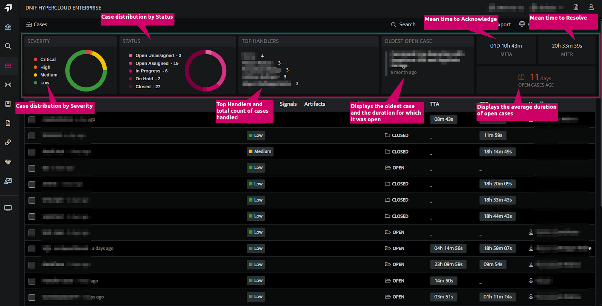
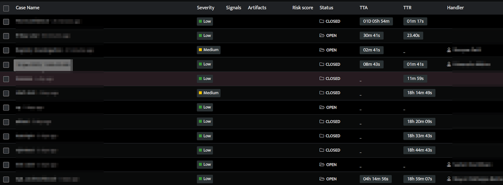
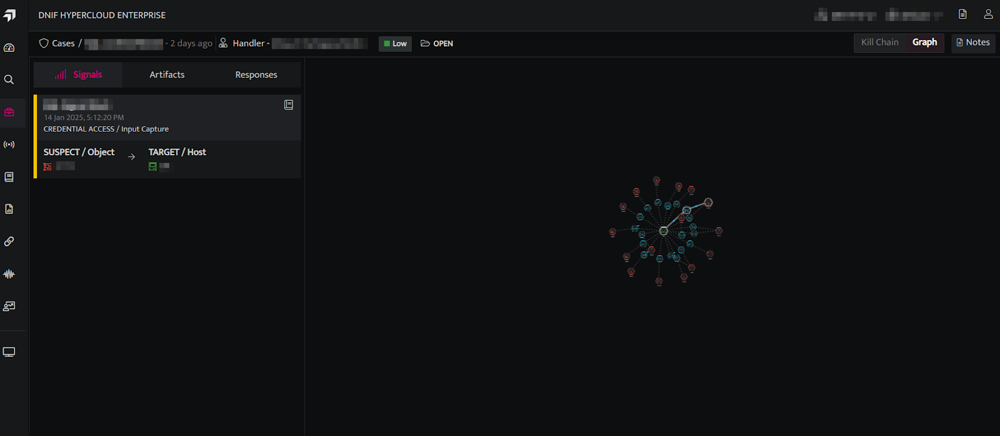
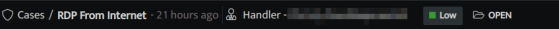
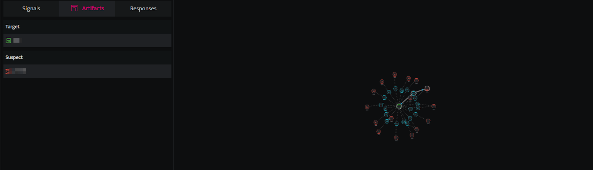
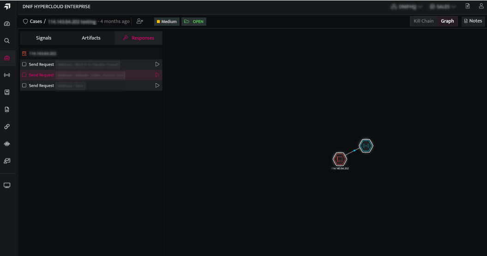

## **Case Listing Page**

- On the left navigation bar, Click the Cases icon to view the cases listing page.

- The top section of the case listing page showcases essential case statistics, including the distribution of cases by severity levels and status values. It also highlights the top handlers, details about the oldest open case, average duration of open cases, MTTA and MTTR values.  
      
      
    

| **Fields** | **Description** |
| --- | --- |
| Severity | Displays the distribution of cases by severity levels:   Critical   High   Medium   Low |
| Status | Displays the distribution of cases by status values:   Open Unassigned   Open Assigned   In-Progress   On-HoldClosed |
| Top Handlers | Lists the top handlers along with the count of cases assigned to each. |
| Oldest open case | Shows the oldest open case along with the duration it has been open. |
| Mean Time To Acknowledge (MTTA) | Displays the average time taken to acknowledge a security alert after it has been generated |
| Mean time to resolution (MTTR) | Displays the average time taken to fully resolve a security incident starting from when it was acknowledged. |
| Open cases age | Displays the average duration of open cases. |

- The table below the top section displays all cases, sorted with the most recent case at the top.  
      
      
      
    

- A case has the following attributes:

| **Fields** | **Description** |
| --- | --- |
| Created Time | The time at which the case was created |
| Case Name | A descriptive title summarizing the nature of the case |
| Severity | Indicates the severity or importance (e.g., Low, Medium, High, Critical). |
| Signals | Signals associated with the Case |
| Artifacts | The evidence gathered in Signals associated with the case i.e. the Suspect and Target objects that should be investigated. |
| Risk score | The sum of the detection scores of all Signals associated with the Case. |
| Status | Current state of the case (e.g. Open, In-Progress, On-Hold, Closed). |
| Notes | Details of the actions performed on the case and notes captured by users. |
| Time to Acknowledge | The time taken to Acknowledge a security alert after it has been generated. |
| Time to Resolve | The time taken to fully resolve a security incident starting from when it was acknowledged. |
| Handler | The investigator responsible for handling the case. |

- Global Cases provides a consolidated view of all cases across Tenants and Scopes, accessible to users with the appropriate permissions.  
     **Note**: Tenants were previously referred to as Clusters.

## **View Case Details**

- On the Case listing page, click on a case to view its details. The following screen is displayed.  
      
      
      
      
    

- The top bar displays the name, the handler, severity level and status of the case.  
      
      
      
    

- The **Signals** tab displays the list of all signals associated with the selected case. The following details are displayed on this tab:
    - Name of the signal
    
    - Date and time of the signal
    
    - Technique and tactic of the signal
    
    - Target / Suspect Host IP Address
    
    - Graphical view of signals

- The following entities can be identified from the **Graph**
    - The targets
    
    - The suspects
    
    - Compromised users
    
    - All the concurrent connections that were accessed by the particular compromised user.
    
    - The different anomalies detected - Authentication anomalies / User location anomalies.

- The **Artifacts** tab displays the evidence gathered in Signals associated with the case i.e. all the Suspect and Target objects, identified in Signals associated with the case, that should be investigated. For further investigation refer to the [Investigate Anywhere](https://dnif.it/kb/security-monitoring/investigate-signals/investigate-anywhere/) doc.  
      
      
      
      
    

- The **Responses** tab displays the list of all the Suspect and Target objects, identified in Signals associated with the case. It also allows the user to respond to each object.  
      
      
    
