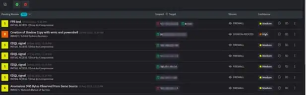
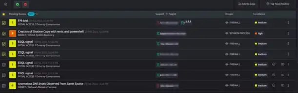
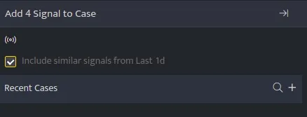
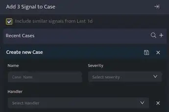

Signals generally coalesce within a rolling window of three hours if all the fields match, including suspects and target list.

In case if there is a time difference of more than three hours but all the other values match you can select the checkbox to move all those signals into the case.

To add multiple signals to a case follow the steps mentioned below.

- Select the icon Add Multiple signals to case, a checkbox will be added next to each signal.

- Select the signals that you want to add to a case.

- Click **Add to Case** after selecting the signals, the following screen will be displayed.

- Select/ unselect the checkbox **Include similar signals from last 1d** as per your requirement, this checkbox is selected by default.

- You can search for a recent case and click save to add the selected signals to an existing case or click on the plus sign to create a new case.

| **Field** | **Description** |
| --- | --- |
| Name | Enter a name for the new case |
| Severity | Select a severity level for these signals and case |
|  | Click this icon to search for existing cases |
|  | Click this icon to create a new case |
|  | Click this icon save the Case |
|    Handler | Assign a handler to this case |
