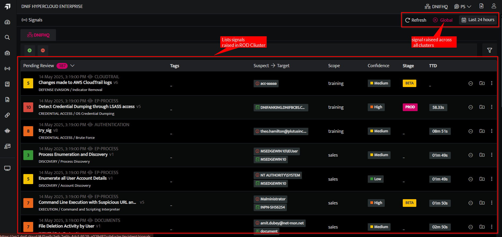

The global signals feature helps you quickly view and respond to sophisticated, clandestine attacks that are attempting to establish a presence within your network. It identifies both confirmed and potential threats, allowing you to quickly remediate the infection and reduce the scope and damage of an attack, whether it’s a known threat campaign that has spread across multiple clusters, or a unique threat that you have never seen before.

The signals raised in each cluster are displayed under the Cluster Name tab.

Global signals will only be accessible to users with multi-scope or multi-cluster access.
