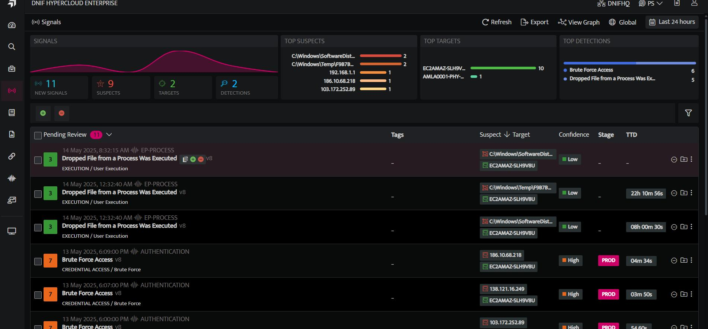
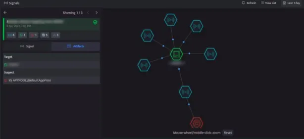
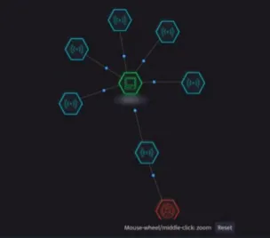
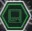
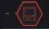
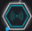
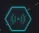
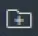

In any environment, during the process of collecting, processing and analyzing data, outliers can come from many sources and hide in many dimensions. Detecting outliers is of major importance for the success and survival of organizations. The rule based correlation, on-demand outlier detection and anomaly models along with automated analysis through graph analytics and threat intelligence ensures to lighten the load on Analysts by adding contexts to everything that demands attention. You can have a detailed understanding of every signal raised and at the same place, visualize and diagnose all the connected anomalies and compromises that happened, a summary of all the observations are generated.

## **How to View Connected Graph?**

- Click the Signals icon on the left navigation bar of the Home screen, the following screen will be displayed.  
      
      
    

- Click **View Graph** on the top right corner of the Signals list page. It will display all the targets and suspects responsible and affected in the graph, this would save a lot of time for the Analysts, from now on they can easily identify all the anomalies in the network.  
      
      
    .  
      
    
- The above screen displays the list of signals detected along with the summary of all the signals raised for the selected duration. You can click on a particular signal to view its connections automatically.  
      
      
      
      
    
- Here it displays the signals and artifacts that are part of the graph, multiple systems have been suspected of targeting the system. Click the **Artifacts** tab to view the list of suspects associated with the signals.

The panel displays the following details of the signals raised:

| **Indication** | **Description** |
| --- | --- |
|  | The green and white with solid line indicates the target in the current case. |
|  | The red and white with solid line indicates the suspect in the current case |
|  | The red with dotted line indicates the suspect in connected signals |
|  | The blue and white with solid line indicates that the particular signal or entity is a part of the current case |
|  | The blue with dotted line indicates that the particular signal or entity is a part of the connected signal |
|  | Click to automatically assign a Case to this signal. Note: By default, the Case name will be same as that of Signal name. |
|  | Click to view and edit the automatically created Case. |
