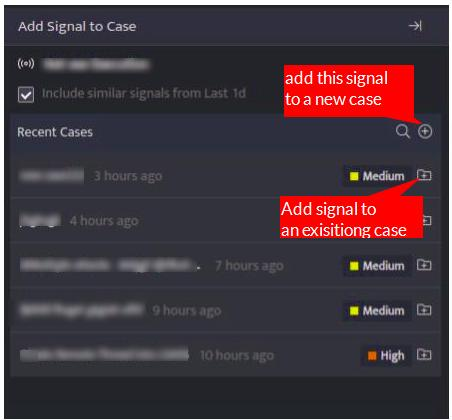

Signal is an individual event that would be indicating any suspicious or malicious event, but by itself it is not an incident. A Collection of signals or a single signal with the highest severity is considered as an incident. Analysts do not have to investigate every single alert, the alerts generated are delegated to signal. Each signal has a name indicating the gist of the incident.

## **How to add a Signal to a Case?**  
  

- Click the **Signals** icon on the left navigation bar of the Home screen, the following screen will be displayed.

- Every signal can have cases assigned to it, select the case icon against the particular signal, the below screen will be displayed.

- You can add this particular signal to an existing case listed under Recent Cases or click the plus sign on the right side to add this signal to a new case. 

- On adding this signal to a new case, the following screen will be displayed

- Enter the following details

| **Field** | **Description** |
| --- | --- |
| Name | Enter a case name |
| Severity | Enter a severity level for the signal |
| Handler     | Click and select the handler/user who will investigate the case from the dropdown.    |

- Enter the above details and click **Save**, the signal will be listed under that particular case.

A signal can be assigned to multiple cases.
