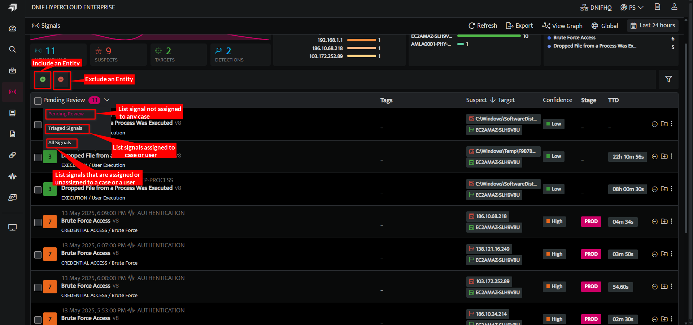
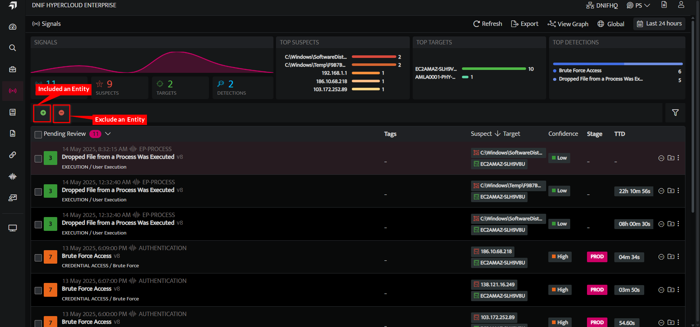
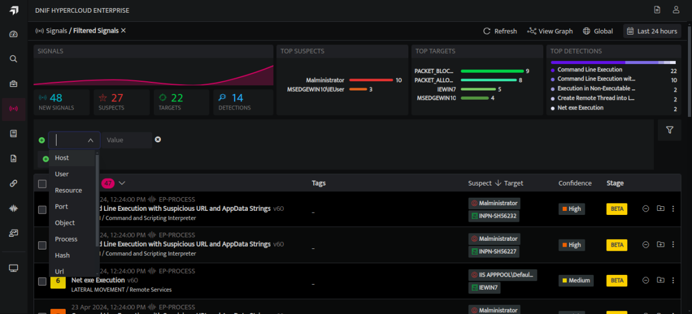
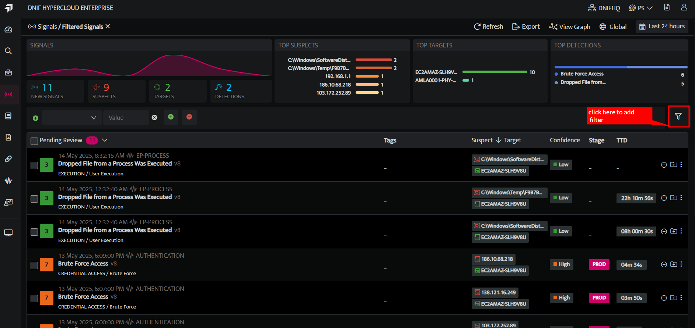
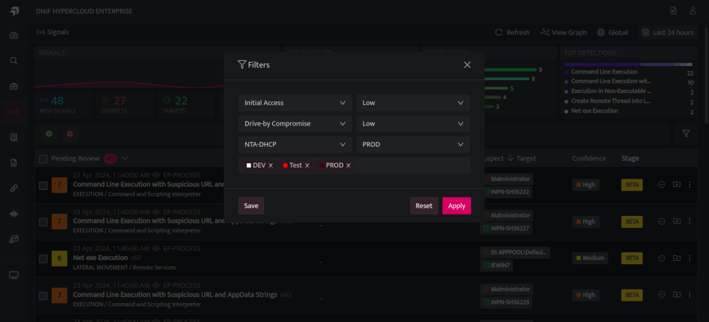
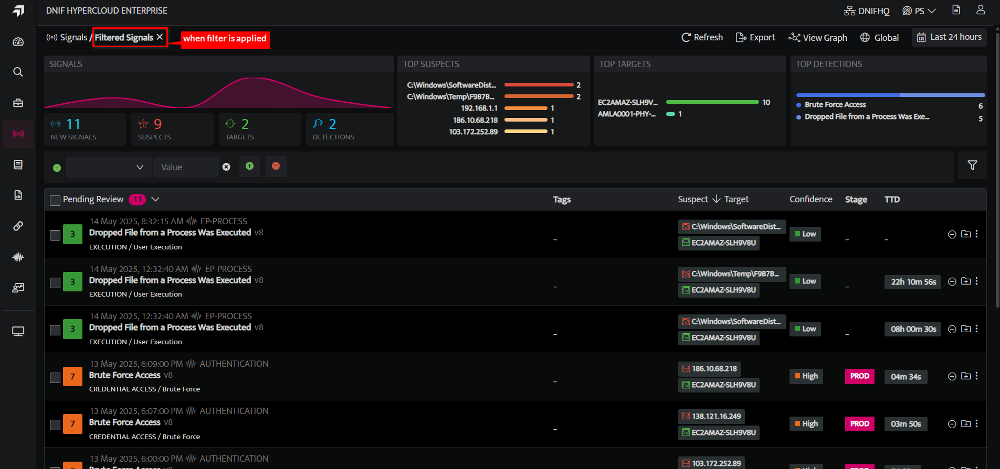

This feature allows you to customize the signals list view, by applying the specific filters you can view only what is required.

You can use the following options to filter the Signals

- **Pending Review:** All the signals that are yet to be investigated will be displayed

- **Triaged Signals:** All the signals that are already under investigation will be displayed, while investigating the signals you can create a case of all connected signals. Refer [Case Management](https://dnif.it/kb/security-monitoring/case-management-security-monitoring/case-management-overview-2/)

- **All Signals:** A collective list of all signals will be displayed, the ones under investigation and the ones that are yet to be investigated.

- **Include / Exclude Entities**: Signals will be displayed as per the entities selected in include/ Exclude

The green plus sign will allow you to include entities and filter accordingly and the red minus sign will allow you to exclude entities and filter accordingly. You can select an entity as required and enter the value.

Customize Signal View with the following filter parameters

- Filtering can be applied to signals using the following:

|   **Filter**   |   **Description**   |
| --- | --- |
|   Tactic   |   Filter by specific attack tactic employed   |
|   Priority   |   Filter by priority of signal   |
|   Technique   |   Filter by attack method used   |
|     Confidence   |   Filter by level of accuracy   |
|     Stream   |   Filter by Stream the signal is raised from   |
|   Stage   |   Filter by Stage   |
|   Tags   |   Filter by Tags assigned   |

- To add a filter click on the filter icon

- Please select the filters you'd like to apply from the options provided.

- Once the filters are applied the screen displays the filtered signals. 

