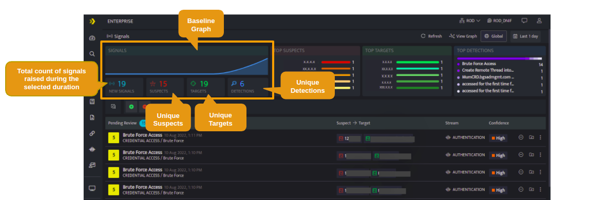
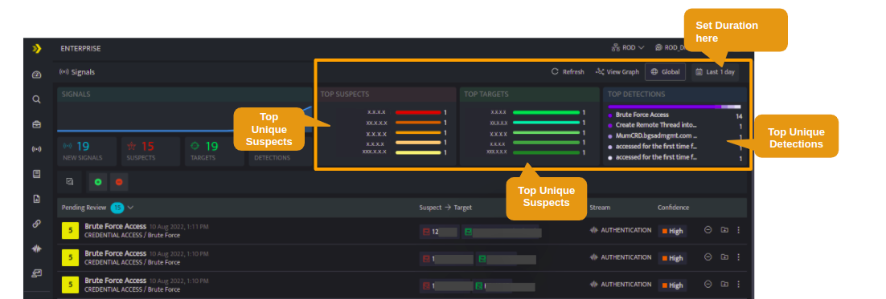

Every Signal will have a suspect and a target. Suspect is the one responsible for the signal and Target is the one affected by the signal.

The following screen displays the unique detections for the selected duration

Highlighted in the below screen are the the top (most recent) detections in the selected duration

