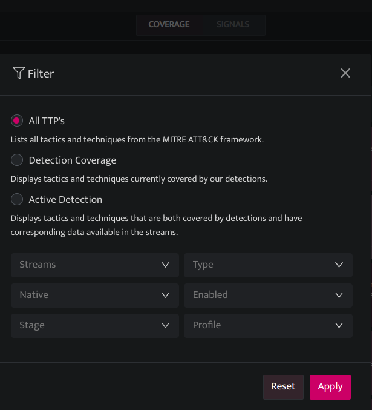
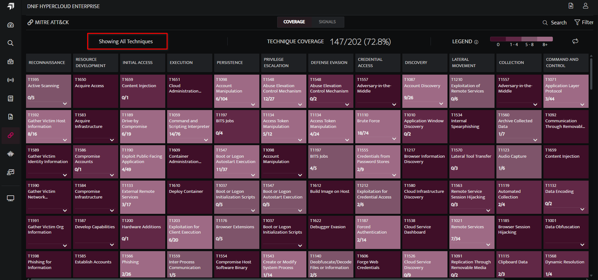
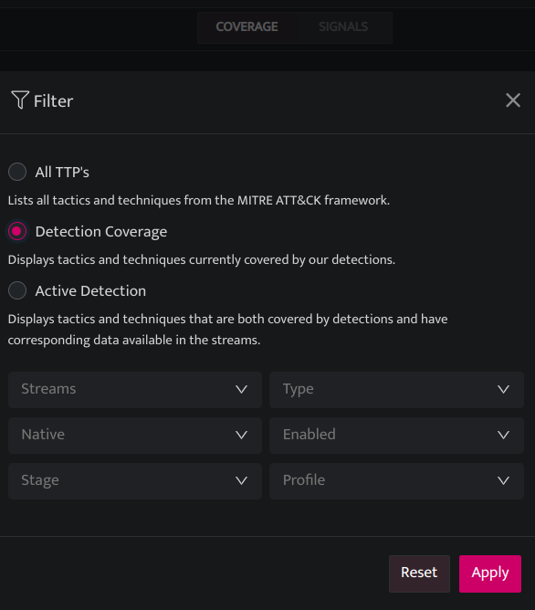
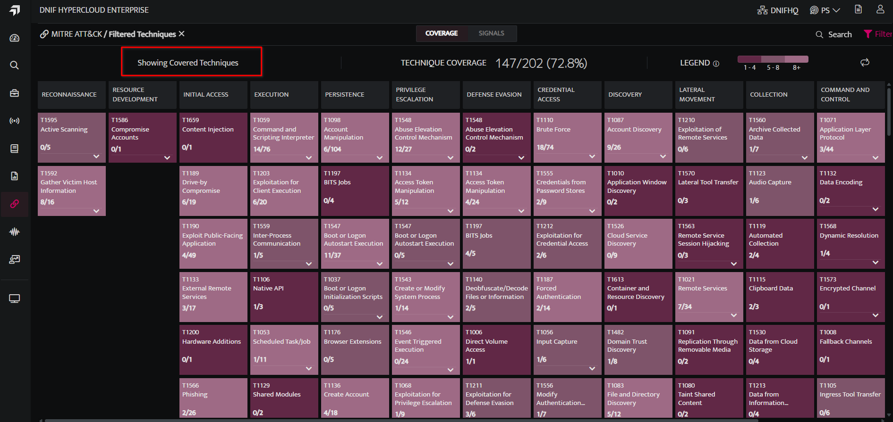
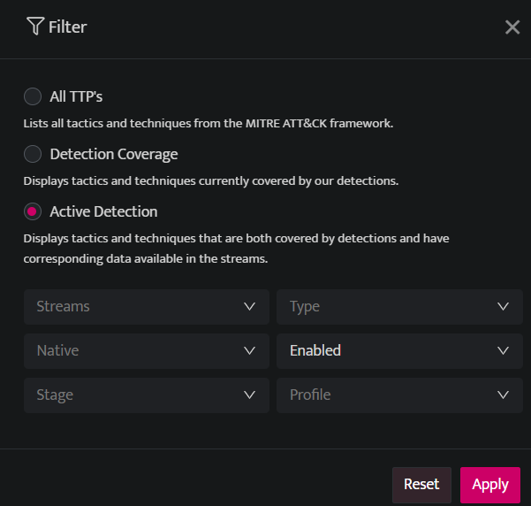
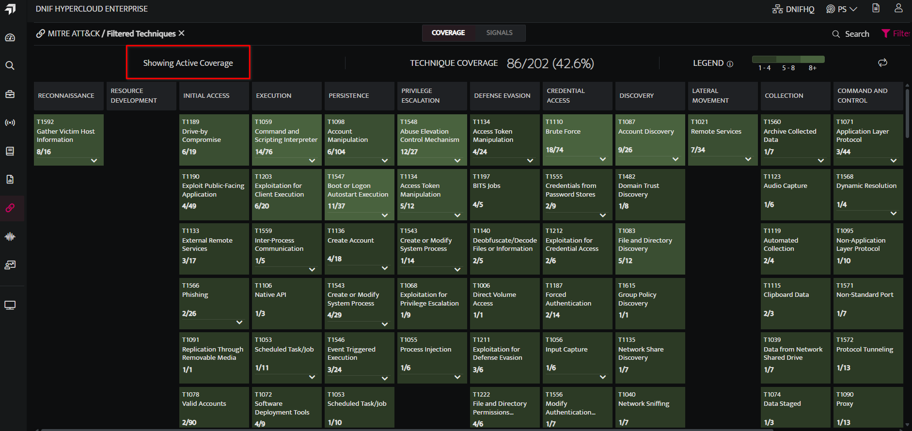
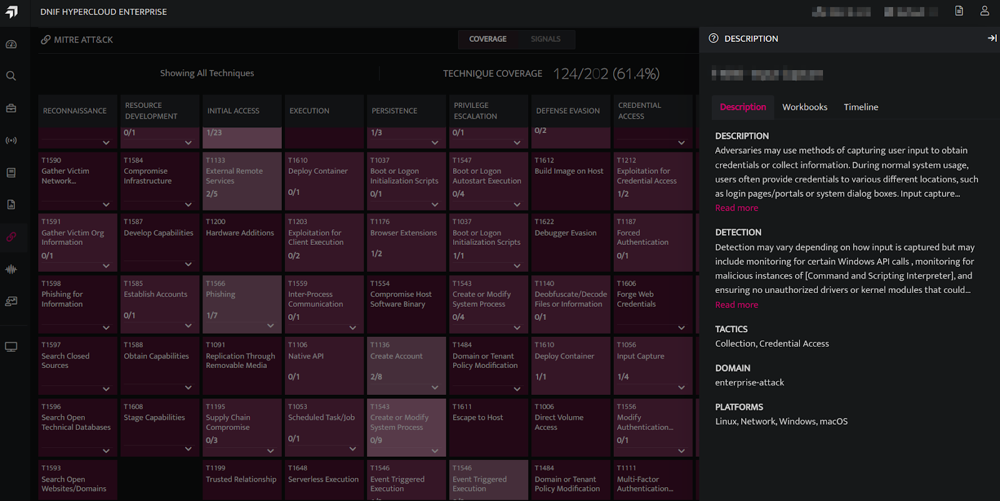
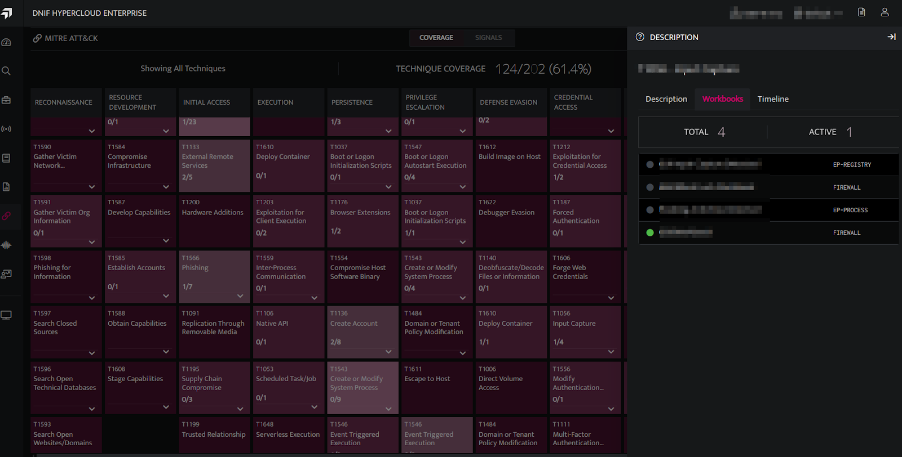
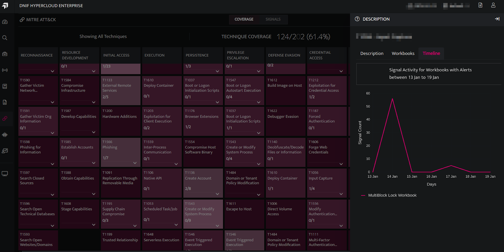

The detection coverage across the MITRE ATT&CK framework is visualized through dynamic and interactive heatmap views of techniques and tactics, providing detailed insights into DNIF's coverage and detection status. 

## **Visualizing All Tactic, Techniques, and Procedures.**  
  

Displays all tactics and techniques from the MITRE ATT&CK framework, with a heatmap representing the detection coverage provided by DNIF workbooks.  
  
  
  

## **Visualizing Detection Coverage**  
  

Displays only the tactics and techniques covered by DNIF, with a heatmap representing the detection coverage provided by DNIF workbooks.   
  
  
  
  

## **Visualizing Active Detection Coverage**  
  

Displays only the tactics and techniques actively covered by DNIF, with a heatmap representing the active detection coverage provided by DNIF workbooks.  
  
  
  
  

## **Filtering by Workbook Attributes**  
  

Users can filter the view using the following options:

| **Fields** | **Description** |
| --- | --- |
| Streams | Eg: Authentication, Firewall |
| Type | Off, Scheduled, Streamed. |
| Native | Native, Custom |
| Enabled | Enabled, Disabled |
| Stage | Prod, Beta, Dev, Test. |
| Profile | Basic, essential, custom |

## **Visualizing the Signal Activity by Timeline**  
  

Click on the Technique Name to view the following:

- **Description:** Provides a description of the selected MITRE technique, including detection methods, corresponding tactics, domains, and platforms for investigation.  
      
      
      
    

- **Workbooks:** View the total number of workbooks and active workbooks available for the selected MITRE technique, with active workbooks denoted by a green bullet. To access a workbook, hover over it and click the icon to open it in a new tab.   
      
      
      
    

- **Timeline**: A line chart depicting signal activity across workbooks for the selected MITRE technique. The timeline window updates dynamically based on the applied filter (default: 7 days - Coverage tab; 1 day, 7 days, or 30 days - Signals tab).   
      
    
