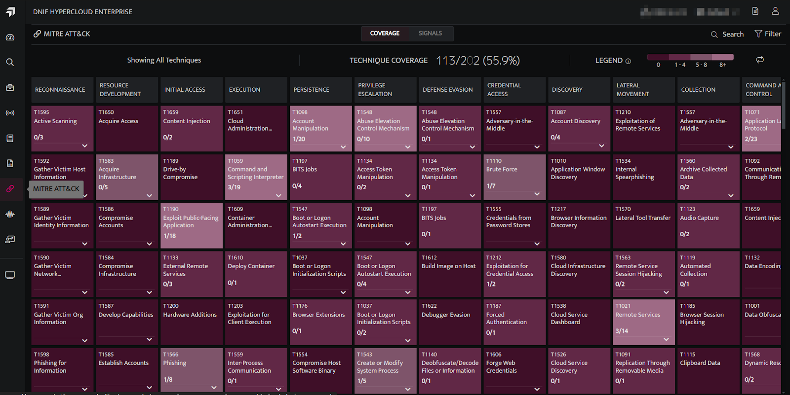
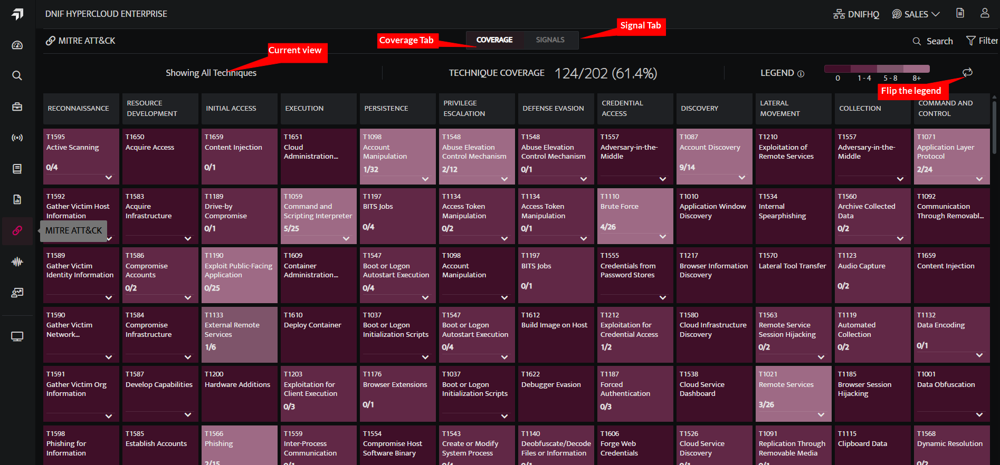
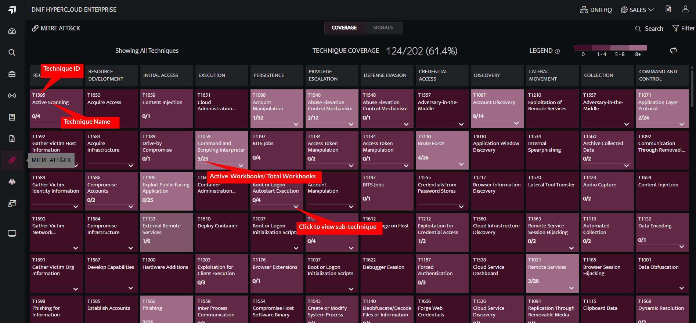
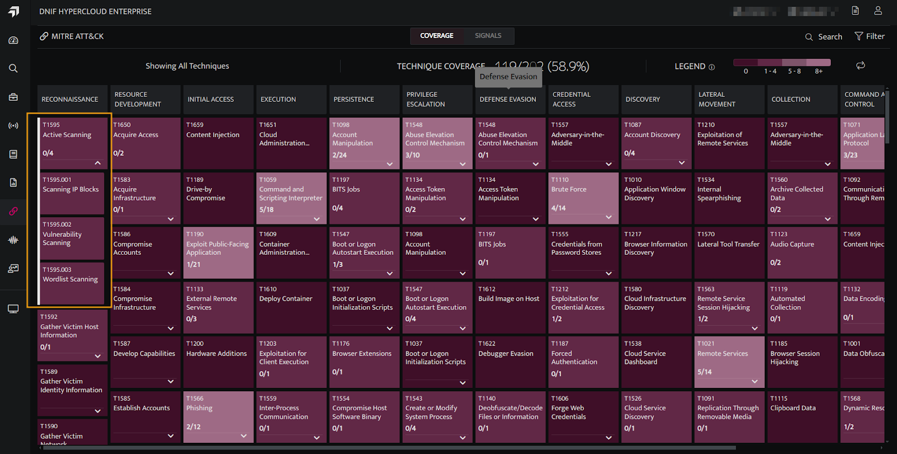
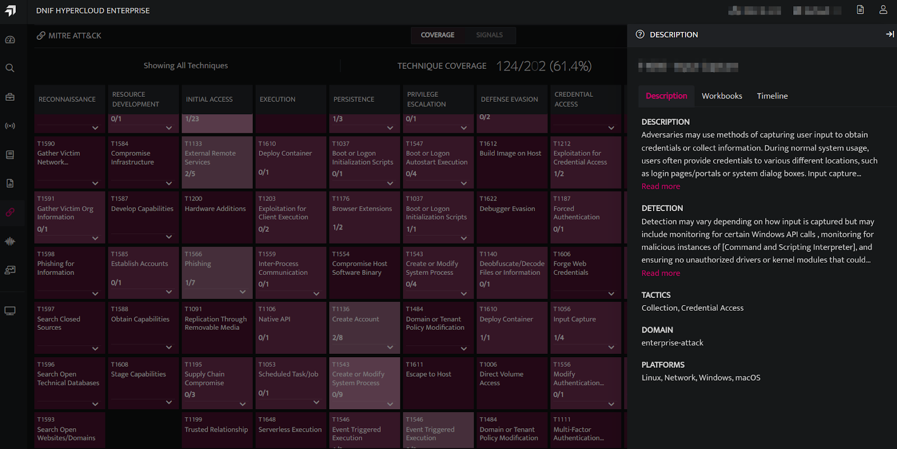

The **MITRE ATT&CK** page presents detection workbook coverage mapped to the MITRE ATT&CK framework. It offers a visual representation of how detection workbooks align with the framework, enabling users to easily analyze and monitor coverage across tactics, techniques, and sub-techniques. 

## **Steps to Access the MITRE Page in the DNIF Console**

- Click on the MITRE ATT&CK icon on the left navigation bar of the Home screen to display the following screen. By default, the MITRE page opens to display the Coverage tab. You can switch to the Signals tab to view the signal activity across MITRE techniques.  
      
      
    

## **Components of MITRE page**  

- **Coverage Tab** \- Displays tactics and techniques currently covered by DNIF’s detection capabilities. 

- **Signals Tab** \- Displays tactics and techniques associated with workbooks that have generated signals.

- **Search** \- Users can search by technique or workbook names.

- **Filter** \- Users can filter the techniques by Detection Coverage, Active Detection Coverage and Workbook attributes.

- **Current view** \- Indicates the active view displayed on the user's screen.

- **Technique Coverage** \- It displays the number and percentage of techniques covered by DNIF detection rules.

- **Legend** \- It represents the colour coding of the heatmap. Users can flip the legend.

- **Tactic, Techniques and Sub-Techniques**
    - Each Technique block shows:
        - The Technique ID and Technique Name.
        
        - Active Workbooks and Total Number of Workbooks.  
              
              
              
            
        
        - Each Subtechnique block shows:
            - Sub-Techniques - Click the dropdown icon on the tactic name to view the sub-techniques associated with that technique.
            
            - The dropdown icon will not be available if the technique has no sub-techniques. You can click on the sub-technique to view its description.  
                  
                  
                  
                

- **Technique Details**  
    Click on the technique name to view the following details:
    - **Description**: The description of the technique and its detections, tactics, domain and platforms.  
          
          
          
        
    
    - **Workbooks**: View the total number of workbooks and the total number of active workbooks.  A workbook is considered active if its corresponding stream contains log data and is either scheduled or streamed and is denoted by a green bullet. To access the workbook, hover over it and open it in a new tab.  
          
          
          
        
    
    - **Timeline:** A line chart providing a graphical representation of signals. The timeline window updates dynamically based on the applied filter  
        (default -7 days - coverage tab)  
        (1 day, 7 days, or 30 day - Signals Tab)
