The **Signals tab** displays techniques associated with workbooks that have triggered signals.  
  
  
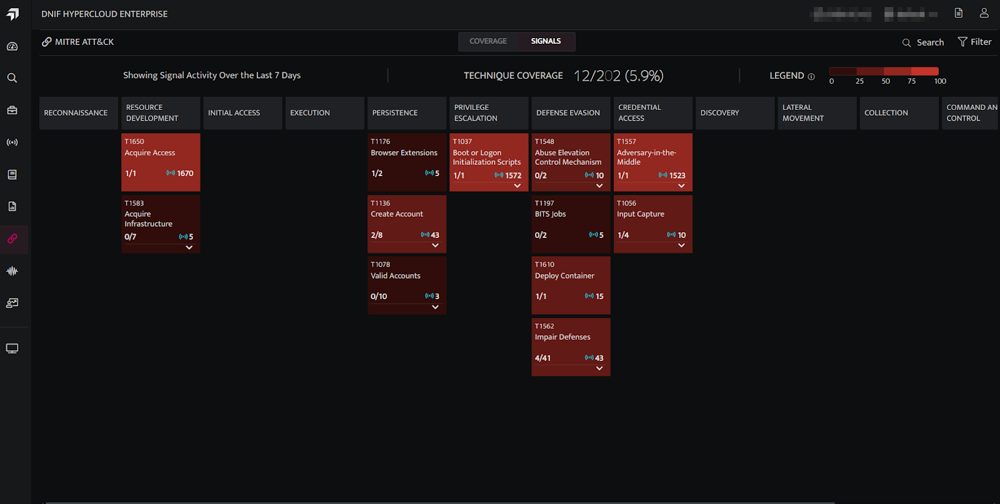

## **Components of Signal Tab**

| **Fields** | **Description** |
| --- | --- |
| Signal Count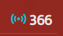  | Total number of signals generated from workbooks associated with a particular technique (in the last 7 days by default). |
| Legend 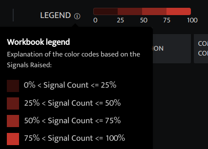 | The color coding represents the ratio of the total signal count for each technique to the sum of all signal counts, displayed as a percentage across the selected duration.    |

## **Filtering over Signal Activity:**

- **1 Day:** Shows signal activity for the current day.  
      
    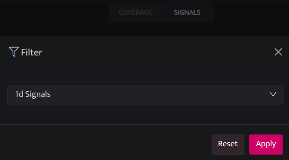  
      
      
    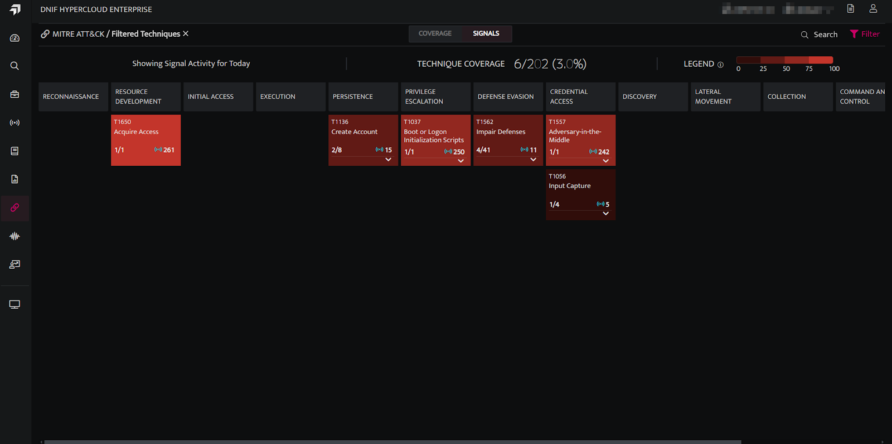  
      
    

- **7 Day:**  Shows Signal Activity over the last 7 days. (default time filter)  
      
    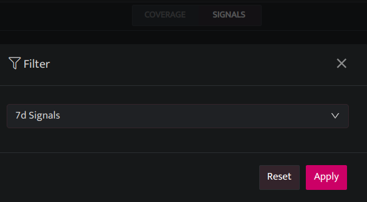  
      
      
    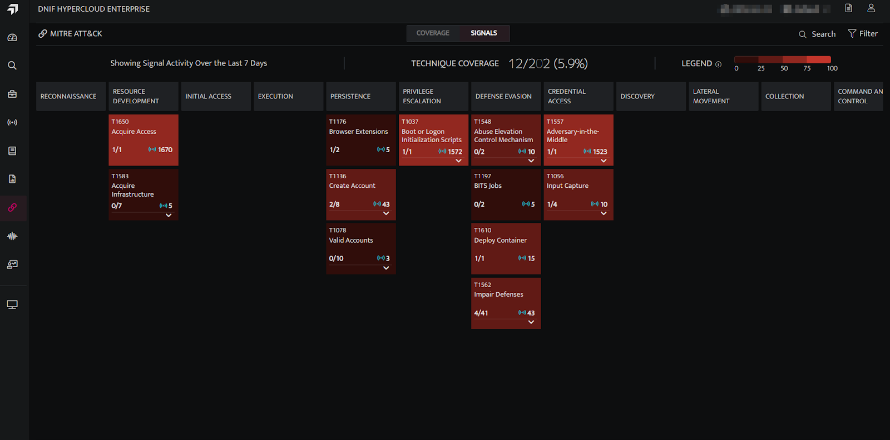  
      
    

- **30 Day:** Shows Signal Activity over the last 30 days.  
      
    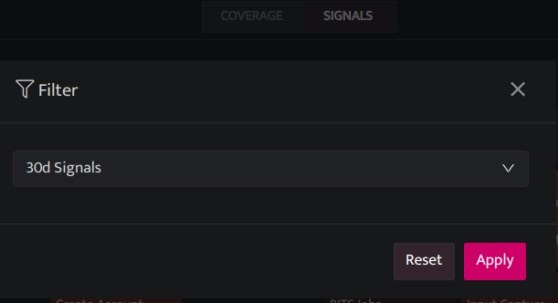  
      
      
    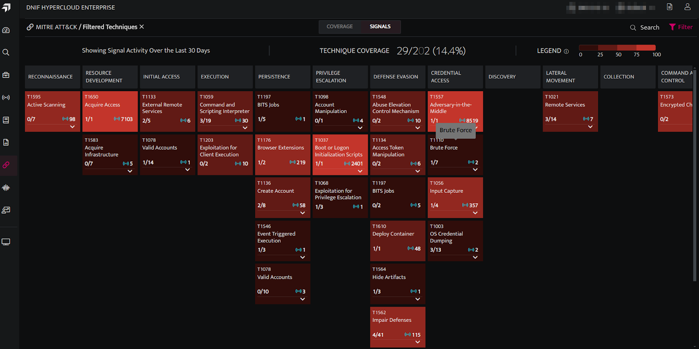  
      
    

###### **Visualizing the Signal Activity by Timeline**

Displays a line chart of signal activity over the selected duration (default: 7 days). Users can view signal counts for specific days or times. By clicking on a workbook name in the list, its data line is highlighted, allowing users to investigate signal activity for the selected workbook. (**Note:** To deselect a workbook, double-click its name.) 

- Showing signal activity for the current day.  
      
    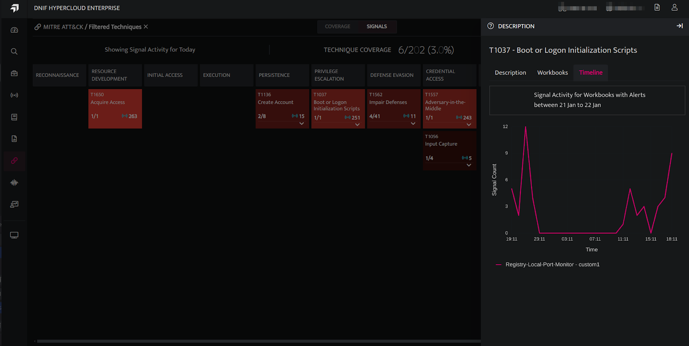  
      
    

- Showing Signal Activity over the last 7 days.  
      
    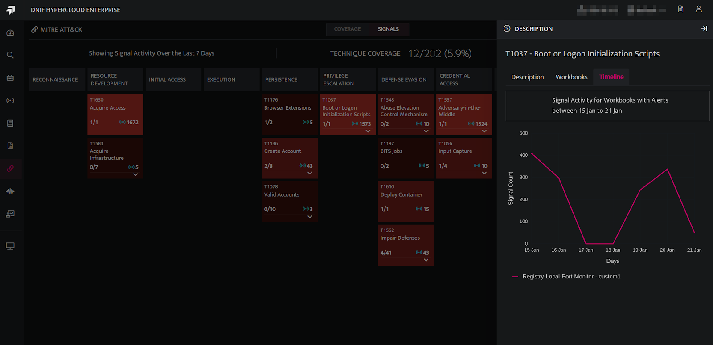  
      
    

- Showing Signal Activity over the last 30 days.  
      
    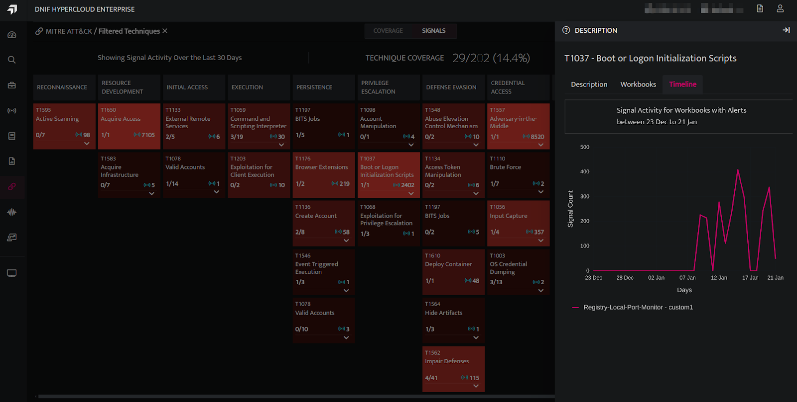
