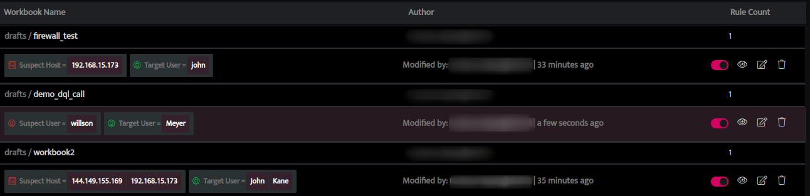
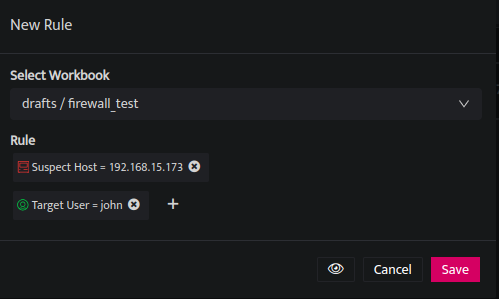
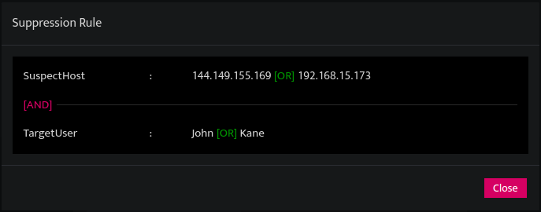
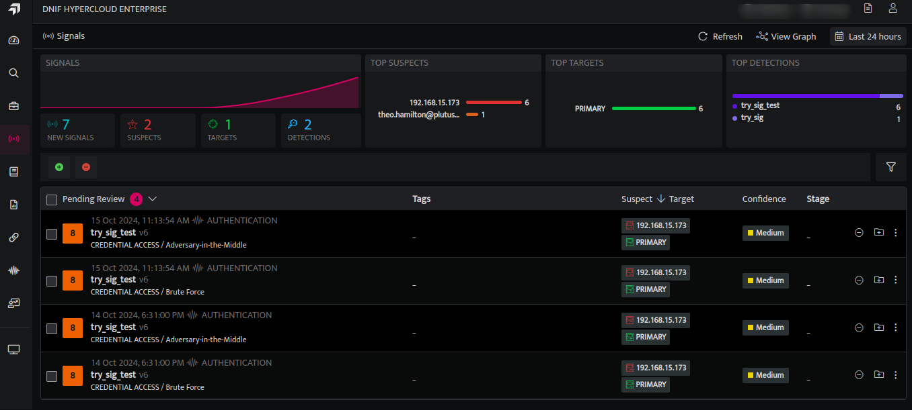
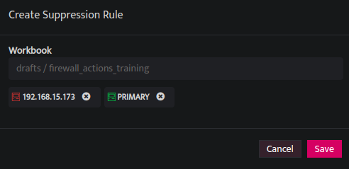

Signal Suppression Rules can be created from the following pages:

- Signal Suppression Rules listing page

- Signals listing page

### **Creating Signal Suppression Rules from Signal Suppression Rules Listing page**  
  

<iframe width="560" height="315" src="https://www.youtube.com/embed/V3Xg8AuTXuk?si=c-Wm2-L8L6v-w7MC" title="YouTube video player" frameborder="0" allow="accelerometer; autoplay; clipboard-write; encrypted-media; gyroscope; picture-in-picture; web-share" referrerpolicy="strict-origin-when-cross-origin" allowfullscreen></iframe>

1. Hover on the **System** icon on the left navigation bar of the Home screen. From the options displayed, select **Signal Suppression Rules**. The page displaying the list of signal suppression rules on workbooks will be shown.  
      
    
      
    

3. To add a new suppression rule to an existing workbook, click the **plus icon** on the extreme right corner of the page.

5. On the next screen, from the drop-down, select the particular workbook for which you want to add new suppression rules.  
      
    
      
    

7. You can add multiple rules in any combination. Select a **target** or **suspect** and then select **host**, **user**, **resource**, etc., and enter the corresponding value (e.g. IP Address / user name/ port number) for which alerts will be suppressed.

9. You can now add multiple values separated by comma (",") to a field. The rule will be applied if any one of these values is matched (OR operator).   
    E.g. Suspect User = ‘Jack’, ‘Jane’ implies that the condition is met when the Suspect User is either ‘Jack’ **OR** ‘Jane’.

11. If there are multiple suspect and target fields defined, then all the conditions must be matched for the suppression rule to apply.  
    E.g. Suspect Host = ‘144.149.155.169’ Target User= ‘John’ implies that the condition is met when the Suspect Host = ‘144.149.155.169’  **AND** Target User =  ‘John’

13. Click on the **Eye icon** to see the logical representation of the rule.  
      
    
      
    

15. Click **Save**. Once a suppression rule is created, signals that satisfy these conditions will be suppressed.

### **Creating Signal Suppression Rules from the Signals Listing Page:**     
  

<iframe width="560" height="315" src="https://www.youtube.com/embed/h-Kr5UNQBG0?si=wOFS2Tv3itiPfw9W" title="YouTube video player" frameborder="0" allow="accelerometer; autoplay; clipboard-write; encrypted-media; gyroscope; picture-in-picture; web-share" referrerpolicy="strict-origin-when-cross-origin" allowfullscreen></iframe> 

1. Click the **Signals** icon on the left navigation bar of the Home screen. The list of signals will be displayed.  
      
    
      
    

3. Select the signal for which you want to create a suppression rule. Click on the vertical ellipsis displayed on the extreme right of the signal and select **Create Suppression Rule**.   
      
    
      
    

5. Click **Save** to create a suppression rule for the selected signal. Alerts that satisfy the conditions specified in the rule will be suppressed.

### **Important Notes:**

- For a workbook, there can be several Signal Suppression rules defined. Whenever a signal is generated for a workbook, the system checks all the Signal Suppression rules assigned to that workbook until either a matching rule is found or all rules are examined.
