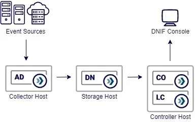
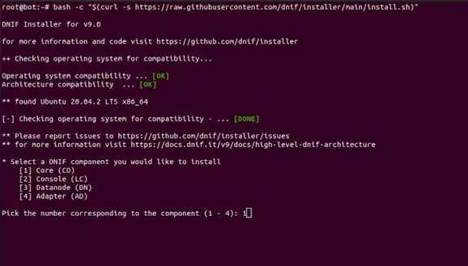

<iframe width="560" height="315" src="https://www.youtube.com/embed/yLHzDQe4Lt4?si=JqJAN71ruj36vGCa" title="YouTube video player" frameborder="0" allow="accelerometer; autoplay; clipboard-write; encrypted-media; gyroscope; picture-in-picture; web-share" referrerpolicy="strict-origin-when-cross-origin" allowfullscreen></iframe>


Welcome to the quick start guide, let's attempt to get your DNIF cluster up and running within the next 10 minutes.

This guide will install DNIF on three cloud instances, however the same process can be used to install on hyper converged infrastructure or even baremetal hardware. DNIF components are available in the form of Docker container images that are available on Docker Hub.



Each component should be installed/configured separately on three different servers, and should be configured in the following sequence.

- Core and DNIF Console (These two can be deployed on the same server)

- Datanode

- Adapter

**Operating System**

**Operating System**  
Recommended [Ubuntu Server 20.04 (LTS)](https://ubuntu.com/download/server) 64-bit.

We will use a standard DNIF deployment (D0) template for this setup, with the following components

- **Collector host** - collect, extract, enrich and index collected events using an Adapter (AD)

- **Storage host** - index and correlate threat signals using Datanodes (DN)

- **Controller host** - control and manage the components using the Core (CO), the controller host will host the analysts Console (LC)

## **Before we begin**

Some notes before we start

- All the conditions mentioned in **[Before your Begin](https://dnif.it/kb/getting-started/before-you-begin/)** and [**Minimum Requirements**](https://dnif.it/kb/solution-design/minimum-requirements/) should be met before proceeding with Installation.

- You will need a license key to initiate the cluster, you can get one by contacting your DNIF Account Manager.

- Relevant connectivity will be required for the installer script to download and install docker, docker-compose, openjdk and the DNIF component images from docker-hub

- It is recommended to use the private host addresses for crosstalk between the components, while using a public (private works as well) host address for the local console.

## **Installation**

All DNIF components can be installed using a single command, this is a helper script that prepares the host operating system, installs the required dependencies, downloads container images and boots up fresh new containers. Use the command below to install the latest version of DNIF.

```
sudo bash -c "$(curl -s https://raw.githubusercontent.com/bloo-team/dnif-installer/main/install.sh)"
```

The installation will perform basic OS checks and will prompt you to pick a component you would like to install.



Begin the installation with the Core (CO), as it controls and manages the cluster. All components will need the host address of the CO so it can find the cluster head at first boot.

It's recommended to use the private address of the CO, so all the cluster crosstalk remains internal.

At the end of each installation you should see the outcome of docker ps, you should see your container in the running state.

In this setup we are installing the Console (LC) on the same host as the CO, so we repeat the installation, this time selecting to install the LC.

Repeat the process for all the other components and complete the installation phase.

## **Setup**

After the installation is complete and all your components are in the running state, we will proceed to the setup wizard.

1. Fire up your favorite browser and point it to the host address of the LC, don't forget to use https:// along with the address. You should see the welcome screen. Click **Next** to continue.

3. Create your first admin user, remember these credentials will be required for the first login. After the details are filled click **Next** to continue.

5. The Console needs to make a connection with the Core, provide the host address (private address is preferable) of the Core, click Connect to validate the connection. Typical failures include - the wrong address and port restrictions between the two hosts (only applicable in a scaled setup).

7. Setup the cluster name - choose a name for your cluster. Click **Next** to continue.

9. Provide your license key, click **Next** to continue.

11. Accept the licensing terms and conditions, click **Next** to continue.

13. We are ready to login to the console for the first time, click **Finish.**

## **Configuration**

This is the final stage of the setup, before we can start ingesting events. You will need to sign in to the Console using the user we created in the setup stage. Let's get started.

1. Point your browser to the host address of the Console, don't forget to use https://, if you are just finishing setup, you should already be redirected to the login page.

3. Sign in to the console using the administrator account we created.

5. You should see the **Administration** section (the lock icon) on the navbar on the left > **Manage Components**

7. You should see all the installed components in the Components table. Click the Inactive tag against the Adapter (AD), you should see the side panel.

9. You can choose to change name of the component, you should pick a default scope from the scope drop down, this will be important in case you have a multi scope deployment. Save, and your Adapter should be discovered and made active.

11. Click the Inactive tag against the Datanode (DN), the side panel will allow you to change the name to something meaningful. After you submit, it should take a few minutes for the components to initialize itself and turn Active and ready for action.

You are now ready to ingest events from your sources. The syslog connector (UDP) is active by default and any events being forwarded should be available for you to query.

Congratulations!~ you have a fully functional DNIF cluster. Remember, DNIF comes built in with activated content, which means you could directly start forwarding events from your sources. DNIF will find the right extractors, and run them through the stream processors to detect signals.
