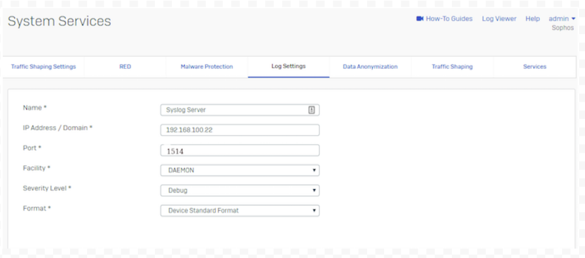
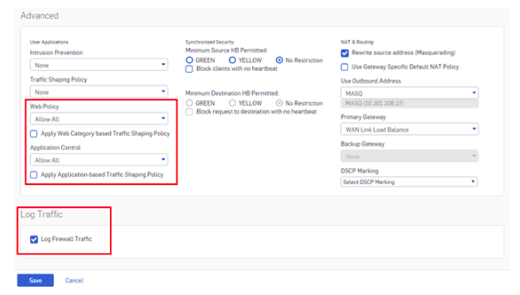

## **Configure the Syslog Server in Sophos XG Firewall**

You can configure a syslog server in Sophos Firewall by following the instructions below:

1. Navigate to **System Services > Log Settings** and click **Add** to configure a syslog server.  
2. Enter a **Name** for the syslog server.  
3. Enter the **IP Address** of the syslog server. Messages from the device will be sent to this IP.  
4. Enter a **Port number** that the device will use to communicate with the syslog server.

> ✅ **Firewall Analyzer uses port `1514` as the default syslog server port.**

5. Select the **Facility** from the available options. For example, the default value is `DAEMON`.  

   - **Facility** helps the syslog server identify the log source. This is useful for distinguishing log messages from multiple devices.

   **Available options:**
   - `DAEMON` (Default): Services running on the device as daemons  
   - `KERNEL`: Kernel-level logs  
   - `LOCAL0` to `LOCAL7`: Custom log levels  
   - `USER`: Logs related to users connected to the server  

6. Select the **Severity Level** from the available options. Severity determines the importance of logs captured.  
   - The firewall logs all messages with severity **equal to or higher** than the selected level.

   **Available options:**
   - `Emergency` (Default): System is unusable  
   - `Alert`: Immediate action required  
   - `Critical`: Critical issue  
   - `Error`: General errors  
   - `Warning`: Warnings of possible issues  
   - `Notification`: Normal but significant events  
   - `Information`: Informational messages  
   - `Debug`: All debug-level messages  

7. Select the **Format**. Currently, Sophos supports only its own standard log format.  

   

8. Click **Save** to apply the configuration.

---

Once you have added the syslog server:

- Navigate to **System > System Services > Log Settings**  
- Enable the logs that you want to forward to the syslog server under the **Log Settings** section.

---

## **Enable Traffic Logging**

### 1. **Enable Firewall Traffic Logs**

- Navigate to **Firewall > Edit Firewall Rule**.  
- In the **Log Traffic** section, enable logging of traffic.  
- This ensures all traffic passing through the firewall rule is recorded and visible in the **Log Viewer**.  
- ✅ **Recommended:** Enable logging for **all firewall rules**.

  

---

### 2. **Apply Security Policies**

Ensure that a valid security policy is applied:
- Choose from `Allow All`, `Default Policies`, or a custom security policy.  
- If set to `None`, the firewall may not generate logs.

---

### 3. **Enable Local Logging**

- Navigate to **Configure > System Services > Log Settings**  
- Enable the checkbox for **Log Type (System)** to start local logging.  
- ✅ **Recommended:** Enable logging for **all modules** for complete visibility.

---

[📖 Official Documentation](https://support.sophos.com/support/s/article/KB-000035777?language=en_US#Check%20Status%20of%20Logging%20and%20Security%20Policies)
