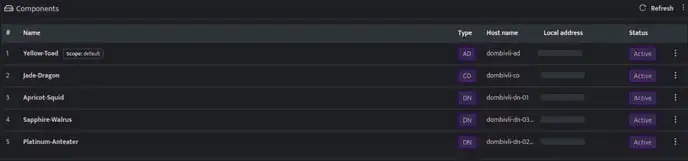
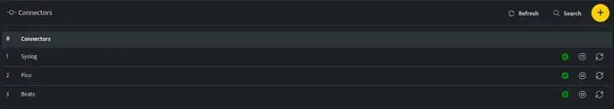
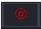

###### **Configure a connector instance to directly ingest logs into DNIF**

- Login to DNIF Console using valid credentials.

- Hover on the **Administration** icon on the left sidebar of the Home screen, from the option displayed select **Manage Components**, the following screen will be displayed.

- Click the **Component name** against the **Adapter** or **PICO** component, health page will be displayed, the connectors list is displayed at the bottom of the page.

By default, **Syslog Connector** and **PICO** connector will be automatically added while onboarding Adapter.

- Connectors can be managed using the following icons displayed on each row of the connector.

| Icon | Description |
| --- | --- |
|  | Indicates that the connector is up and running |
|  | Indicates that the particular connector is stopped |
|  | Click this to restart the connector |

###### **Configurations**

The following are the configurations to configure a connector:
