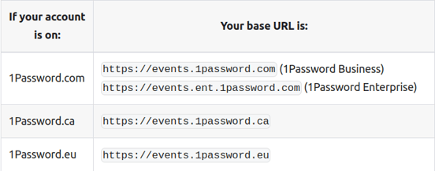
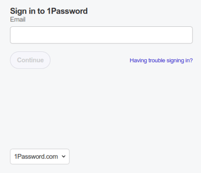
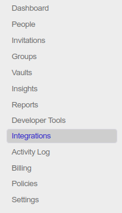
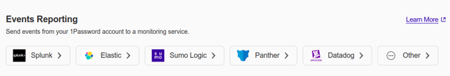
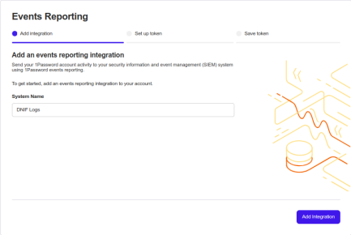
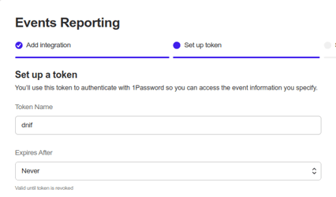
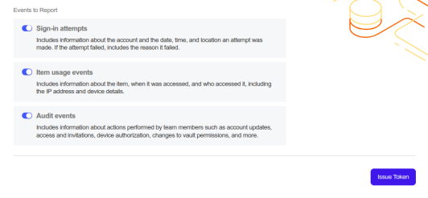
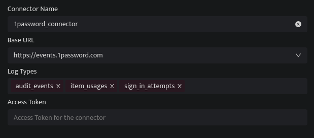

1Password connector utilizes the pull method to retrieve Dropbox Logs through the 1Password events API.

###### **Prerequisites**

- 1Password Account.

- Base URL

- Log Types

- Access Token

###### **How to derive the prerequisites?**

- Get your Base URL  by referring to the [Servers](https://developer.1password.com/docs/events-api/reference/#servers) section in the 1Password Docs.

- Sign in to your 1Password account using the following link [https://start.1password.com/signin](https://github.com/login)

- Click **Integration** in the sidebar.  
      
      
      
    

- Click **Directory** at the top of the page.

- Scroll down to the **Events Reporting** section then click **Other**

- Enter a **System Name** for the integration, then click **Add Integration**.  
      
      
      
    

- Enter a name for the token and choose token expiration.  
    

- Select the event types your token will have access to and click the **Issue Token** to generate the access token key.  
      
      
    

- Copy and securely store the token. Click **Save in 1password** and choose which vault to save to.  
      
    

###### **Configurations**

- The following are the configurations to forward 1Password Connector logs to DNIF.‌  
      
    

| **Field**  | **Description** |
| --- | --- |
| Connector Name | Enter a name for the connector |
| Base URL | Select the Base URL for 1Password API |
| Log Types | Select the log types |
| Access Token | Enter the Access Token |

The following optional configurations can be done based on requirement

| **Field** | **Description** |
| --- | --- |
|   | Set the loglevel   0: DEBUG   1: INFO   4: WARNING   5: ERROR   6: CRITICAL |
| Number of Threads | Number of threads to publish logs |
| Size limit  | Size limit for creating bunching of logs to be sent |
| Wait Time | Max time to wait for log bunching in second |
