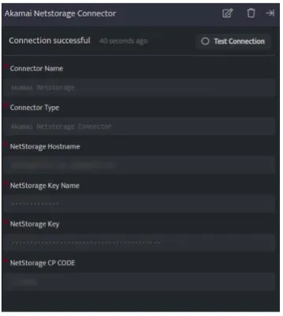

Akamai connector is intended to read and ingest content from your NetStorage Account.

###### **Prerequisites**

- Netstorage Domain Name

- Netstorage Key Name

- Netstorage Key

- Netstorage CP Code

###### **How to derive the prerequisites?**

- In Akamai, in the left menu navigate to ORIGIN SERVICES > NetStorage.

- In the left menu, click Upload Accounts.

- Create an upload account if required, and enable the HTTP API authentication in access methods, this will give you the **NetStorage Key**.

- The **NetStorage** **Hostname** is xxx-nsu.akamaihd.net

- The **NetStorage** **Key name** is the id of the upload account.

- Each NetStorage storage group can have multiple upload directories, adding an upload directory will also add a CP Code (the upload directory name will be the **NetStorage** **CP Code**. )

[https://techdocs.akamai.com/netstorage/docs/create-an-upload-account](https://techdocs.akamai.com/netstorage/docs/create-an-upload-account)

[https://techdocs.akamai.com/netstorage/docs/the-netstorage-usage-api-1](https://techdocs.akamai.com/netstorage/docs/the-netstorage-usage-api-1)

###### **Configurations**

The following are the configurations to forward Akamai NetStorage logs to DNIF.

| **Field** | **Description** |
| --- | --- |
| Connector Name | Enter a name for the connector |
| Connector Type | Enter Akamai Netstorage Connector |
| NetStorage Hostname | Enter your Netstorage Hostname |
| NetStorage Key Name | Enter your NetStorageKeyname (id of the upload account) |
| NetStorage Key | Enter your NetStorageKey you get while enabling HTTP API authentication |
| NetStorage CP Code | Enter your NetStorage CP Code (the upload directory name) |

- Click **Save** after entering all the required details and click **Test Connection**, to test the configuration.

- A **Connection successful** message will be displayed on screen along with the time stamp.

- If the connection is not successful an error message will be displayed. Refer [Troubleshooting Connector Validations](https://dnif.it/kb/troubleshooting-and-debugging/troubleshooting-connector-validations/) for more details on the error message.

Once the connector is configured, validate if the connector is listed under **[Collection Status](https://dnif.it/kb/operations/collection-status/)** screen with status as **Active**. This signifies the connector is configured successfully and data is ready to ingest.
