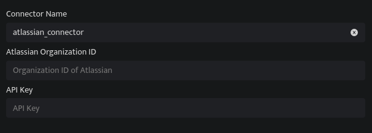

Atlassian provides team collaboration software that helps teams organize, discuss, and complete shared work. DNIF can collect, normalize, and monitor Atlassian organization audit logs, helping you identify any suspicious activity within your organization in real-time.

###### **Pre-requisites**

- Atlassian organization ID

- Atlassian API Key

###### **Steps to derive prerequisites**

- Go to [admin.atlassian.com](http://admin.atlassian.com/). Select your organization if you have more than one.

- Select **Settings > API keys**.

- Select **Create API key** in the top right.

- Enter a name that you'll remember to identify the API key.

- By default, the key expires one week from today. If you'd like to change the expiration date, pick a new date under **Expires on**. You're unable to select a date longer than a year from the date of creation.

- Select **Create** to save the API key.

- Copy the values for your **Organization ID** and **API key**. You'll need those to use the API key.  
    **Note**: Make sure you store these values in a safe place, as we won't show them to you again.

- Select **Done**. The key will appear in your list of API keys.  
    **Note**: If you have trouble creating the API key, refer to the detailed guide - [Organization Audit logs](https://support.atlassian.com/organization-administration/docs/manage-an-organization-with-the-admin-apis/).

###### **Configurations**

| **Field Name** | **Description** |
| --- | --- |
| Connector Name | Enter a name for the connector |
| Atlassian Organization ID | Enter the Organization ID of Atlassian |
| API Key | Enter the Atlassian API Token |

- Click **Save** after entering all the required details and click **Test Connection**, to test the configuration.

- A **Connection successful** message will be displayed on the screen along with the time stamp.

- If the connection is not successful an error message will be displayed. Refer to [Troubleshooting Connector Validations](https://dnif.it/kb/troubleshooting-and-debugging/troubleshooting-connector-validations/) for more details on the error message.
