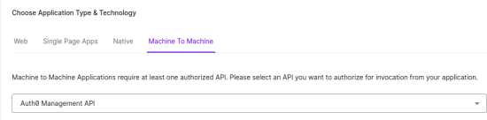

Select the **Settings** ta

Auth0 connector utilizes the pull method to retrieve Auth0 Logs through the Auth0 Management API.

###### **Prerequisites**  

- Auth0 Account

- Domain

- Client ID

- Client Secret

- API Identifier(API Audience)

###### **How to derive the prerequisites?**

- Login to [Auth0 Dashboard](https://auth0.com/api/auth/login?redirectTo=dashboard)

- In the sidebar, click **Applications** under **Applications**  
    

- Click **Create Application**  
    

- Fill out the application form, enter the **Application Name**

- Choose the Application type as **Machine To Machine** and select **Auth0 Management API** as the API of the application.  
      
      
      
    

- After selecting the API, below in the permissions section enable **read:logs** and **read:logs\_users** permissions and then click **Continue.**  
    

- Select the **Settings** tab  
      
    

- Scroll down to see the credentials, copy the **Domain**, **Client ID**, **Client Secret** and store them securely.  
      
    

###### **Configurations**  
  

The following are the configurations to forward Auth0 Connector logs to DNIF.‌

| **Field**  | **Description** |
| --- | --- |
| Connector Name | Enter a name for the connector |
| Domain | Enter your Auth0 organization Domain |
| Client ID | Enter your Auth0 application Client ID |
| Client Secret | Enter your Auth0 application Client Secret |
| API Identifier | Enter Auth0 API Identifier token |

The following optional configurations can be done based on requirement.

| **Field** | **Description** |
| --- | --- |
| Log Level | Set the loglevel   0: DEBUG   1: INFO   4: WARNING   5: ERROR   6: CRITICAL |
| Number of Threads  | Number of threads to publish logs |
| Size limit  | Size limit for creating bunching of logs to be sent |
| Wait Time | Max time to wait for log bunching in seconds |
