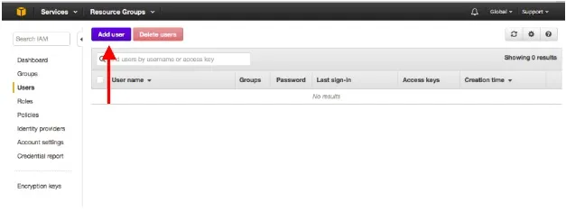
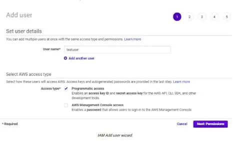
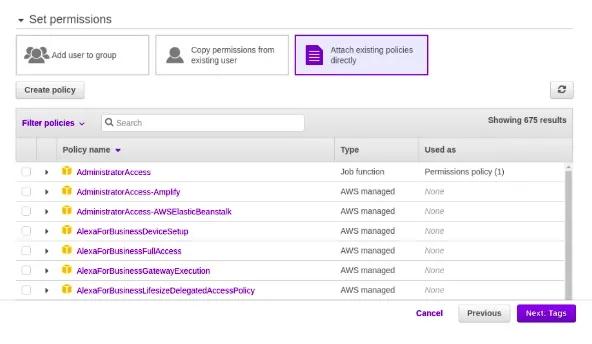
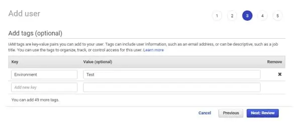
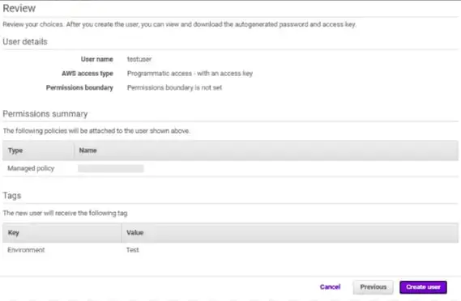
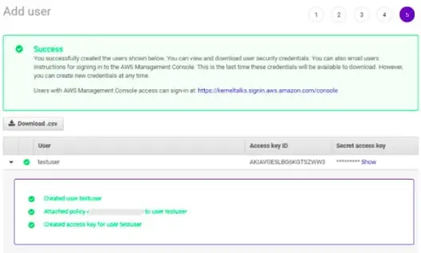
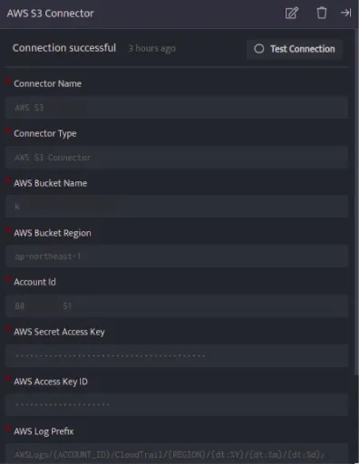

Amazon Simple Storage Service (Amazon S3) is storage for the internet. You can use Amazon S3 to store and retrieve any amount of data at any time, from anywhere on the web. You can accomplish these tasks using the AWS Management Console, which is a simple and intuitive web interface.

AWS S3 connector script reads the logs from the S3 bucket according to the configuration and Each AWS S3 service provides operational metrics or log files to provide insight into how the service is operating. Additionally, many AWS S3 services generate security log data, including audit logs for access, configuration changes, and billing events.

Buckets are the containers for objects. You can have one or more buckets. For each bucket, you can control access to it (who can create, delete, and list objects in the bucket), view access logs for it and its objects, and choose the geographical region where Amazon S3 will store the bucket and its contents.

###### **Pre-requisites**

- Connectivity with AWS S3 bucket using valid credentials
    - Required credentials:
        - AWS\_SECRET\_ACCESS\_KEY
        
        - AWS\_ACCESS\_KEY\_ID
        
        - AWS account id

###### **Create an AWS S3 bucket**

To create a bucket

- Sign in to the AWS Management Console and open the Amazon S3 console at [https://console.aws.amazon.com/s3/](https://console.aws.amazon.com/s3/)

- Choose Create bucket, the Create bucket page is displayed.

- In Bucket name, enter a DNS-compliant name for your bucket. The bucket name must:
    - Be unique across all of Amazon S3.
    
    - Be between 3 and 63 characters long.
    
    - Not contain uppercase characters.
    
    - Start with a lowercase letter or number.

- After you create the bucket, you can't change its name. For information about naming buckets, see [Bucket naming rules](https://docs.aws.amazon.com/AmazonS3/latest/userguide/bucketnamingrules.html).

In Region, choose the AWS Region where you want the bucket to reside.

Choose a Region that is close to you geographically to minimize latency and costs and to address regulatory requirements. Objects stored in a Region never leave that Region unless you explicitly transfer them to another Region. For a list of Amazon S3 AWS Regions, see [AWS Service Endpoints](https://docs.aws.amazon.com/general/latest/gr/rande.html#s3_region) in the Amazon Web Services General Reference.

In Bucket settings for Block Public Access, keep the values set to the defaults.

By default, Amazon S3 blocks all public access to your buckets. It is recommend to keep all Block Public Access settings enabled. For more information about blocking public access, see [Blocking public access to your Amazon S3 storage](https://docs.aws.amazon.com/AmazonS3/latest/userguide/access-control-block-public-access.html).

- Choose Create bucket, you've created a bucket in Amazon S3.

###### **Creating IAM user with programmatic access**

You can create one or more IAM users in your AWS account. You might create an IAM user when someone joins your team, or when you create a new application that needs to make API calls to AWS.

For official documentation [Click here](https://docs.aws.amazon.com/IAM/latest/UserGuide/id_users_create.html)

- Sign in to the AWS S3 Management Console and open the IAM console at [https://console.aws.amazon.com/iam/](https://signin.aws.amazon.com/signin?redirect_uri=https%3A%2F%2Fconsole.aws.amazon.com%2Fiam%2F%3Fstate%3DhashArgs%2523%26isauthcode%3Dtrue&client_id=arn%3Aaws%3Aiam%3A%3A015428540659%3Auser%2Fiam&forceMobileApp=0&code_challenge=EGqQriHoUlLe6OR38jl__a6MnqZ3B8GFJZic2Djbytg&code_challenge_method=SHA-256).

- You will need one of the following details to login to IAM Console.
    - The account alias.
    
    - The 12-digit AWS account ID.
    
    - The user name for your IAM user.
    
    - The password for your IAM user.

- If you are a root user or IAM administrator and need to provide the AWS account ID or AWS account alias to an IAM user, see Your AWS account ID and its alias.

- If you are an IAM user, you can log in using either a sign-in URL or the main sign-in page.

- In the navigation pane, choose **Users** and then choose **Add User**.



- Enter the user name for the new user. This is the sign-in name for AWS S3.

- On the same screen, under "Select AWS access type", check the checkbox to enable AWS Management Console access.



- Select **programmatic access** as access type for this user.

- Choose **Next: Permissions**.

- On the **Set permissions** page, specify how you want to assign permissions to this set of new users. Choose **Attach existing policies directly > Create Policy**



- Create policy using [json method](https://docs.aws.amazon.com/IAM/latest/UserGuide/access_policies_create-console.html#access_policies_create-json-editor)

- Following is the required policy in json format

```
{  "Version": "2012-10-17",  "Statement": [    {      "Effect": "Allow",      "Action": [        "s3:ListBucket",        "s3:GetObject",        "s3:ListAllMyBuckets",        "s3:GetBucketLocation"      ],      "Resource": "*"    }  ]}
```

- You can find the newly created policy in **Attach existing policies directly**

- Apply the policy to the IAM user.

- Click **Next**: Tags button



- Add user tags for identification purpose and click on **Next:Review** button.



- Review all the configurations and click **Create user** button.



- Click on the Download .csv button to download the key pair or click on Show link under the Secret access key and then copy/save both the Access key ID and Secret access key.

In case of an already existing IAM user, create access keys using the steps mentioned here: [AWS Account and Access Keys](https://docs.aws.amazon.com/powershell/latest/userguide/pstools-appendix-sign-up.html)

###### **Configurations**

The following are the configurations to forward AWS S3 logs to DNIF.



| **Field**  | **Description** |
| --- | --- |
| Connector Name | Enter a name for the connector |
| Connector Type | Enter AWS\_connector |
| AWS Bucket Name | Enter the name of the AWS S3 Bucket |
| AWS Bucket Region | Enter the region of AWS S3 Bucket |
| Account Id | Enter AWS S3 Account Number |
| AWS Secret Access Key | Enter the AWS\_SECRET\_ACCESS\_KEY received from AWS S3 credentials |
| AWS Access Key ID | Enter the AWS\_SECRET\_ACCESS\_ID received from aAWS S3 credentials |
| AWS Log Prefix | Enter the AWS S3 prefix to fetch logs \[ex: AWSLogs/111111111/CloudTrail/us-east-2/\] |
| Region | Select regions for the aws s3 prefix   us-east-2   us-east-1   us-west-1   us-west-2   af-south-1   ap-east-1   ap-south-1   ap-northeast-3   ap-northeast-2   ap-southeast-1   ap-southeast-2   ap-northeast-1   ca-central-1   cn-north-1   cn-northwest-1   eu-central-1   eu-west-1   eu-west-2   eu-south-1   eu-west-3   eu-north-1   me-south-1   sa-east-1   us-gov-east-1   us-gov-west-1 |
| File Type | Type of the file inside AWS S3 bucket |

- Click **Save** after entering all the required details and click **Test Connection**, to test the configuration.

- A **Connection successful** message will be displayed on screen along with the time stamp.

- If the connection is not successful an error message will be displayed. Refer [Troubleshooting Connector Validations](https://dnif.it/kb/troubleshooting-and-debugging/troubleshooting-connector-validations/) for more details on the error message.

Once the connector is configured, validate if the connector is listed under **[Collection Status](https://dnif.it/kb/operations/collection-status/)** screen with status as **Active**. This signifies the connector is configured successfully and data is ready to ingest.
