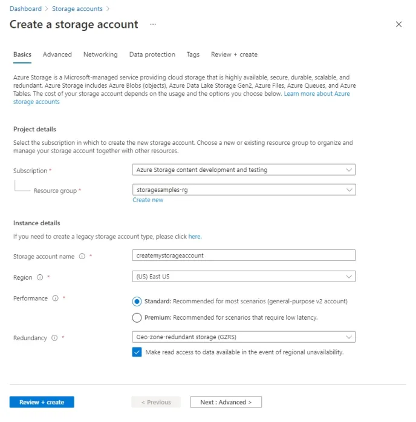
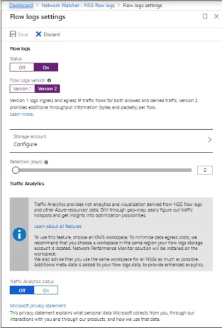
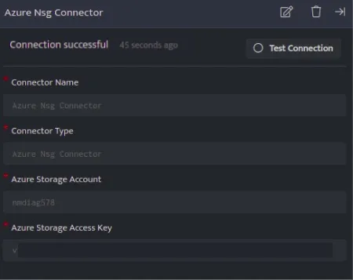

Azure NSG Connector pulls network flow logs from azure.

###### **Pre-requisites**

**Create a Storage Account**

To create an Azure storage account with the Azure portal, follow these steps:

- From the left portal menu, select Storage accounts to display a list of your storage accounts.

- On the Storage accounts page, select New. The following image shows a standard configuration for a new storage account.  
      
      
    

- On the Basics tab, provide the essential information for your storage account.

- Select **Review + create** to accept the default options and proceed to validate and create the account.

- You can also choose to further customize your new storage account by setting options on the other tabs.

- For more information refer.[https://docs.microsoft.com/en-us/azure/storage/common/storage-account-create?tabs=azure-portal](https://docs.microsoft.com/en-us/azure/storage/common/storage-account-create?tabs=azure-portal)

###### **Create a Container**

To create a container in the Azure portal, follow these steps:

- Navigate to your new storage account in the Azure portal.

- In the left menu for the storage account, scroll to the Blob service section, then select Containers.

- Select the + Container button.

- Type a name for your new container. The container name must be lowercase, must start with a letter or number, and can include only letters, numbers, and the dash (-) character. For more information about container and blob names, refer [Naming and referencing containers, blobs, and metadata](https://docs.microsoft.com/en-us/rest/api/storageservices/naming-and-referencing-containers--blobs--and-metadata).

- Set the level of public access to the container. The default level is Private (no anonymous access).

- Select OK to create the container.  
      
      
      
      
    

For more information on creating containers refer  
[https://docs.microsoft.com/en-us/azure/storage/blobs/storage-quickstart-blobs-portal](https://docs.microsoft.com/en-us/azure/storage/blobs/storage-quickstart-blobs-portal)

###### **Enable NSG Flow logs**

- NSG flow log data is written to an Azure Storage account. To create an Azure Storage account, select + Create a resource at the top, left corner of the portal.

- Select Storage, then select Storage account - blob, file, table, queue.

- Enter, or select the following information, accept the remaining defaults, and then select Create.SettingValueName3-24 characters in length, can only contain lowercase letters and numbers, and must be unique across all Azure Storage accounts.LocationSelect your locationResource groupSelect Use existing, and then select myResourceGroup

- Don't continue with remaining steps until the storage account is created. In all cases, the storage account must be in the same region as the NSG.

- In the top, left corner of portal, select All services. In the Filter box, type Network Watcher. When Network Watcher appears in the search results, select it.

- Under LOGS, select NSG flow logs, as shown in the following image:  
      
    

- From the list of NSGs, select the NSG named myVm-nsg.

- Under Flow logs settings, select On. Select the flow logging version. Version 2 contains flow-session statistics (Bytes and Packets)  
      
      
      
      
    

- Select the storage account that you created in step 3.

NSG Flow Logs do not work with storage accounts that have hierarchical namespace enabled.

- In the top, left corner of portal, select All services. In the Filter box, type Network Watcher. When Network Watcher appears in the search results, select it.

- Set Retention (days) to 5, and then select Save.

For more details on Enable NSG Flow logs refer: [https://docs.microsoft.com/en-us/azure/network-watcher/network-watcher-nsg-flow-logging-portal#register-insights-provider](https://docs.microsoft.com/en-us/azure/network-watcher/network-watcher-nsg-flow-logging-portal#register-insights-provider)

###### **Storage Account Access Keys**

Storage accounts should have owner access roles assigned.

On creating a storage account, Azure generates two 512-bit storage account access keys. These keys can be used to authorize access to data in your storage account via Shared Key authorization. Your storage account access keys are similar to a root password for your storage account.

You can view and copy your account access keys with the Azure portal, PowerShell, or Azure CLI. The Azure portal also provides a connection string for your storage account that you can copy.

To view and copy your storage account access keys or connection string from the Azure portal:

- Navigate to your storage account in the Azure portal.

- Under Settings, select Access keys. Your account access keys appear, as well as the complete connection string for each key.

- Locate the Key value under key1, and click the Copy button to copy the account key.

- Alternately, you can copy the entire connection string. Find the Connection string value under key1, and click the Copy button to copy the connection string.  
      
      
    

You can use either of the two keys to access Azure Storage, but in general it's a good practice to use the first key, and reserve the use of the second key for when you are rotating keys.

For more details on storage connection string refer:  
[https://docs.microsoft.com/en-us/azure/storage/common/storage-account-keys-manage?tabs=azure-portal](https://docs.microsoft.com/en-us/azure/storage/common/storage-account-keys-manage?tabs=azure-portal)

###### **Configurations**

The following are the configurations to forward Azure NSG logs to DNIF.

| **Field Name**  | **Description** |
| --- | --- |
| Connector Name | Enter a connector name |
| Connector Type | Enter Azure NSG connector |
| Azure Storage Account | Enter the azure account Name received from azure console |
| Azure Storage Access Key | Enter the azure storage access key got from azure console |

- Click **Save** after entering all the required details and click **Test Connection**, to test the configuration.

- A **Connection successful** message will be displayed on screen along with the time stamp.

- If the connection is not successful an error message will be displayed. Refer [Troubleshooting Connector Validations](https://dnif.it/kb/troubleshooting-and-debugging/troubleshooting-connector-validations/) for more details on the error message.

Once the connector is configured, validate if the connector is listed under **[Collection Status](https://dnif.it/kb/operations/collection-status/)** screen with status as **Active**. This signifies the connector is configured successfully and data is ready to ingest.
