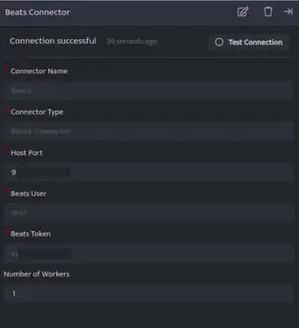
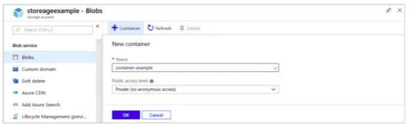

Beats are open source data shippers that you install as agents on your servers to send operational data to the DNIF Beats Connector. DNIF supports collecting from all available OSS beats but recommends integration with Winlogbeat for Windows and Auditbeat for Linux systems.

###### **Configuration**

**Beats**

Beats are open source data shippers that you install as agents on your servers to send operational data to the DNIF Beats Connector. It provides Beats for capturing:

- Linux Audit Logs - Auditbeat

- Filebeat

- Metricbeat

- Windows event logs - Winlogbeat

The following are the configurations to forward Beats Connector logs to DNIF.‌



| **Field** | **Description** |
| --- | --- |
| Connector Name | Enter a name for the connector |
| Connector Type | Enter Beats Connector |
| Host Port | Port at which you want to configure the connector |
| Beats User | Enter a Username. **Note:** Save this username safely as it will be used during the installation process (Winlogbeat and Auditbeat). |
| Beats Token | The token is auto generated.   **Note:** Save this token number safely as it will be used as password during the installation process (Winlogbeat and Auditbeat) |

- The Username and Password generated while configuring the connector needs to be added while configuring the following product of beats.

- Each Beat is a separately installable product.

- Click **Save** after entering all the required details and click **Test Connection**, to test the configuration.

- A **Connection successful** message will be displayed on screen along with the time stamp.

- If the connection is not successful an error message will be displayed. Refer [Troubleshooting Connector Validations](https://dnif.it/kb/troubleshooting-and-debugging/troubleshooting-connector-validations/) for more details on the error message.

Once the connector is configured, validate if the connector is listed under **[Collection Status](https://dnif.it/kb/operations/collection-status/)** screen with status as **Active**. This signifies the connector is configured successfully and data is ready to ingest.

###### **Auditbeat**

- Auditbeat is a lightweight shipper that can be installed on the server to audit the users and process activities of the system.

- It collects and centralizes audit events from the Linux Audit Framework.

- It is used to detect changes to critical files, like binaries and configuration files, and identify potential security policy violations.

###### **Installation**

- Download the OSS version of the auditbeat from the following link: [https://www.elastic.co/downloads/beats/auditbeat-oss](https://www.elastic.co/downloads/beats/auditbeat-oss)

- After installation locate and edit the **auditbeat.yml** file from the **/etc/auditbeat/auditbeat.yml** path

- Locate the Outputs session in the file and then locate Elasticsearch Output in it.

```
output.elasticsearch:# Array of hosts to connect to.    	hosts: ["https://<adapter_ip_address>:<port>"]  # Protocol - either `http` (default) or `https`.  #protocol: "https"    	ssl.enable: true    	ssl.verification_mode: none  # Authentication credentials - either API key or username/password.  #api_key: "id:api_key"    	username: ""    	password: ""
```

| **Field** | **Description** |
| --- | --- |
| ip\_address | Enter IP address of the adapter where Beats Connector is configured. |
| Port | Enter the same port number that was provided while configuring the Beats Connector. |
| Username | Enter the same username that was provided while configuring the Beats Connector. |
| Password | Enter the token number that was auto generated while configuring the Beats Connector. |

Auditbeat includes a service unit for Linux systems with **systemd.** Users can manage Auditbeat by using the following **systemd** commands.

- Enter the following command to start Auditbeat  
    systemctl start auditbeat 

- Enter the following command to Stop Auditbeatsystemctl stop auditbeat 

- Enter the following command to view status of Auditbeat  
    systemctl status auditbeat

By default, the Auditbeat service starts automatically when the system boots

- To enable auto start use the following command:systemctl enable auditbeat

- To disable auto start use the following command:  
    systemctl disable auditbeat

Points to remember for Linux and Windows hosts forwarding logs to Logstash.

- Auditbeat is source of incoming Logs for Linux hosts.

- TCP output plugin is used to forward logs to DNIF

- If winlog beat is also forwarded to a logstash then similar approach works for it as well.

###### **Filebeat**

Filebeat is a lightweight shipper for forwarding and centralizing log data.  
Installed as an agent on your servers, Filebeat monitors the log files or locations that you specify, collects log events, and forwards them to the Beats Connector

###### **Installation**

- Download the OSS version of the filebeat from the following link: [https://www.elastic.co/downloads/beats/filebeat-oss](https://www.elastic.co/downloads/beats/filebeat-oss)

- Ater installation locate and edit the filebeat.yml file from the **/etc/filebeat/filebeat.yml** path

- Locate the Outputs session in the file and then locate **Elasticsearch Output** in it.

```
output.elasticsearch:  # Array of hosts to connect to.    	hosts: ["https://<adapter_ip_address>:<port>"]  #hosts: ["localhost:9200"]  # Protocol - either `http` (default) or `https`.  #protocol: "https"   	ssl.enable: true   	ssl.verification_mode: none  # Authentication credentials - either API key or username/password.  #api_key: "id:api_key"   	username: ""   	password: ""
```

And also locate **Filebeat inputs** and set **enabled** as true.

```
filebeat.inputs:# Each - is an input. Most options can be set at the input level, so# you can use different inputs for various configurations.# Below are the input specific configurations.- type: log# Change to true to enable this input configuration.enabled: true
```

| **Field** | **Description** |
| --- | --- |
| Ip\_address | Enter IP address of the adapter where Beats Connector is configured. |
| Port | Enter the same port number that was provided while configuring the Beats Connector. |
| Username | Enter the same username that was provided while configuring the Beats Connector. |
| Password | Enter the same password number that was provided while configuring the Beats Connector. |

Filebeat includes a service unit for Linux systems with systemd. Users can manage Filetbeat by using the following systemd commands.

- Enter the following command to Start Filebeat:systemctl start Filebeat 

- Enter the following command to Stop Filebeat:  
    systemctl stop Filebeat 

- Enter the following command to view the Status of Filebeat:systemctl status Filebeat 

By default, the Auditbeat service starts automatically when the system boots.

- To enable auto start use the following command:systemctl enable Filebeat 

- To disable auto start use the following command:systemctl disable Filebeat 

###### **Metricbeat**

Metricbeat is a lightweight shipper that you can install on your servers to periodically collect metrics from the operating system and from services running on the server.  
Metricbeat takes the metrics and statistics that it collects and ships them to the output that you specify, such as Beats Connector

###### **Installation**

- Download the OSS version of the metricbeat from the following link: [https://www.elastic.co/downloads/beats/metricbeat-oss](https://www.elastic.co/downloads/beats/metricbeat-oss)

- After installation locate and edit the metricbeat.yml file from the /etc/metricbeat/metricbeat.yml path

- Locate the Outputs session in the file and then locate Elasticsearch Output in it.

```
output.elasticsearch:  # Array of hosts to connect to.    	hosts: ["https://<adapter_ip_address>:<port>"]  #Protocol - either `http` (default) or `https`.  #protocol: "https"    	ssl.enable: true    	ssl.verification_mode: none  # Authentication credentials - either API key or username/password.  #api_key: "id:api_key"    	username: ""    	password: ""
```

| **Field** | **Description** |
| --- | --- |
| Ip\_address | Enter IP address of the adapter where Beats Connector is configured. |
| Port | Enter the same port number that was provided while configuring the Beats Connector. |
| Username | Enter the same username that was provided while configuring the Beats Connector. |
| Password | Enter the same password number that was provided while configuring the Beats Connector. |

Metricbeat includes a service unit for Linux systems with systemd. Users can manage Metricbeat by using the following systemd commands.

- Enter the following command to start metricbeatt:systemctl start metricbeat

- Enter the following command to stop metricbeatt:systemctl stop metricbeat

- Enter the following command to view status of metricbeatt:systemctl status metricbeat 

By default, the Auditbeat service starts automatically when the system boots.

- To enable or disable auto start use the following command:systemctl enable metricbeat 

- To disable auto start use the following command:systemctl disable metricbeat 

###### **Winlogbeat**

- Winlogbeat ships Windows event logs to Beats Connector. You can install it as a Windows service.

- Winlogbeat reads from one or more event logs using Windows APIs, filters the events based on user-configured criteria, then sends the event data to the configured outputs (Beats Connector).

- Winlogbeat watches the event logs so that new event data is sent in a timely manner.

- The read position for each event log is persisted to disk to allow Winlogbeat to resume after restarts.

- Winlogbeat can capture event data from any event logs running on your system. (like application events, hardware events, security events, system events)

###### **Installation**

- Download the Winlogbeat zip file from the following link [https://www.elastic.co/downloads/beats/winlogbeat-oss](https://www.elastic.co/downloads/beats/winlogbeat-oss)

- Extract the contents into C:\\Program Files.

- Rename the winlogbeat- directory to Winlogbeat.

- Open a PowerShell prompt as an Administrator (right-click on the PowerShell icon and select Run As Administrator).

- From the PowerShell prompt, run the following commands to install the service.

```
cd 'C:\Program Files\Winlogbeat'
```

```
.\install-service-winlogbeat.psl
```



```
output.elasticsearch:  # Array of hosts to connect to.    	hosts: ["https://<adapter_ip_address>:<port>"]  #Protocol - either `http` (default) or `https`.  #protocol: "https"    	ssl.enable: true    	ssl.verification_mode: none  # Authentication credentials - either API key or username/password.  #api_key: "id:api_key"    	username: ""    	password: ""
```

| **Field** | **Description** |
| --- | --- |
| ip\_address | Enter IP address of the adapter where Beats Connector is configured. |
| Port | Enter the same port number that was provided while configuring the Beats Connector. |
| Username | Enter the same username that was provided while configuring the Beats Connector. |
| Password | Enter the same password number that was provided while configuring the Beats Connector. |

- After you save your configuration file, test it with the following command..\\winlogbeat.exe test config -c .\\winlogbeat.yml -e

- Winlogbeat comes with predefined assets for parsing, indexing, and visualizing your data.

- To load these assets from the installation directory, execute the following command.\\winlogbeat.exe setup -e

- To start the Winlogbeat service, execute the followingC:\\Program Files\\Winlogbeat> Start-Service winlogbeat

- You can view the status of the service and control it from the Services management console in Windows.

- To launch the management console, run this command:C:\\Program Files\\Winlogbeat> services.msc

- To stop the Winlogbeat service execute the following command:C:\\Program Files\\Winlogbeat> Stop-Service winlogbeat
