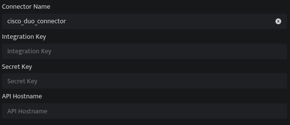

The Cisco Duo Connector provides a secure endpoint to receive authentication logs from the Duo Authentication Logs API. DNIF can collect, normalize, and monitor Cisco authentication logs to help you identify suspicious activity within your workspace in real time.

###### **Pre-requisites**

- [Role required](https://duo.com/docs/admin-roles): Owner

- Integration Key

- Secret Key

- API Hostname

###### **Steps to derive prerequisites:**

**NOTE** : Only administrators with the Owner role can create or modify an Admin API application in the Duo Admin Panel.

1. [Sign up for a Duo account](https://signup.duo.com/).

3. Log in to the [Duo Admin Panel](https://admin.duosecurity.com/) and navigate to **Applications**.

5. Click **Protect an Application** and locate the entry for **Admin API** in the applications list. Click **Protect** to the far-right to configure the application and get your **integration key**, **secret key**, and **API hostname**. You'll need this information to complete your setup. See [Protecting Applications](https://duo.com/docs/protecting-applications) for more information about protecting applications in Duo and additional application options.

7. Determine the permissions you want to grant to this Admin API application.  
    Scroll down to the "Permissions" section of the page and deselect all permission options other than **Grant read log** (The Admin API application can read authentication, offline access, telephony, and administrator action log information).

9. Optionally specify which IP addresses or ranges are allowed to use this Admin API application in **Networks for API Access**. If you do not specify any IP addresses or ranges, this Admin API application may be accessed from any network.  
    The Admin API performs the IP check occurs after verifying the [authentication signature](https://duo.com/docs/adminapi#authentication) in a request. If you restrict the allowed networks for API access and see logged events for blocked Admin API requests from unrecognized IP addresses, this may indicate compromise of your Admin API application's secret key.  
    

- Reference Documents:[Cisco Duo Documentation](https://duo.com/docs/adminapi#first-steps)

###### **Configurations**

The following are the configurations to forward Cisco DUO logs to DNIF.

| **Field Name**  | **Description** |
| --- | --- |
|  Connector Name |  Enter a name for the connector |
|  Integration Key |  Enter the Cisco Duo Integration Token |
|  Secret Key |  Enter the Cisco Duo Secret Token |
|  API Hostname |  Enter the Cisco Duo API Hostname |

- Click **Save** after entering all the required details and click **Test Connection**, to test the configuration.

- A **Connection successful** message will be displayed on screen along with the time stamp.

- If the connection is not successful an error message will be displayed. Refer [Troubleshooting Connector Validations](https://dnif.it/kb/troubleshooting-and-debugging/troubleshooting-connector-validations/) for more details on the error message.

Once the connector is configured, validate if the connector is listed under **[Collection Status](https://dnif.it/kb/operations/collection-status/)** screen with status as **Active**. This signifies the connector is configured successfully and data is ready to ingest.
