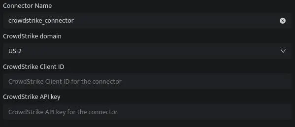

The CrowdStrike Source provides a secure endpoint to receive event data from the CrowdStrike [Streams API](https://falcon.crowdstrike.com/support/documentation/89/event-streams-apis). DNIF can collect, normalize, and monitor CrowdStrike logs to help you identify suspicious activity within your workspace in real time.

###### **Pre-requisites**

- CrowdStrike domain

- CrowdStrike Client ID

- CrowdStrike API key

###### **NOTE:** A user with the Falcon Administrator role is necessary.

###### **Steps to derive prerequisites:**

1. Log in to the Falcon console.

3. Click **Support** > **API Clients and Keys**.

5. Click **+ Add new API Client**.

7. Specify a client name and description.

9. In the API SCOPES section, check **Read** next to **Event Streams** and **Detections**.

11. Click Add.

13. Copy the Base URL, Client ID, and Secret values.

###### **Configurations**

The following are the configurations to forward CrowdStrike Connector logs to DNIF.‌



| **Field Name**  | **Description** |
| --- | --- |
| Connector Name | Enter a name for the connector |
| CrowdStrike domain | Select the CrowdStrike Cloud domain where your integration is hosted |
| CrowdStrike Client ID | Enter the CrowdStrike Client ID |
| CrowdStrike API key | Enter the CrowdStrike API key |

- Click **Save** after entering all the required details and click **Test Connection**, to test the configuration.

- A **Connection successful** message will be displayed on screen along with the time stamp.

If the connection is not successful an error message will be displayed. Refer [Troubleshooting Connector Validations](https://dnif.it/kb/troubleshooting-and-debugging/troubleshooting-connector-validations/) for more details on the error message.

If the connection is not successful an error message will be displayed. Refer [Troubleshooting Connector Validations](https://www.dnif.it/en/kb/troubleshooting-connector-validations) for more details on the error message.

```
Once the connector is configured, validate if the connector is listed under Collection Status screen with status as Active. This signifies the connector is configured successfully and data is ready to ingest
```
