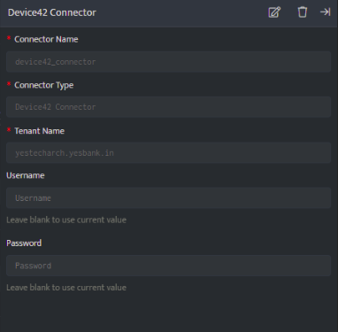

Device42's automated, comprehensive hybrid IT infrastructure discovery pinpoints over-provisioned or under-utilized assets, redundant software, and data center power and thermal issues, providing insights into existing resources and usage. 

This data enables you to accurately forecast future needs, optimize resource allocation, and ensure smooth operations, safeguarding your bottom line.

The following connector is responsible for retrieving audit logs from the Device42 application.

###### **Points to be considered**

- This document provides instructions for integrating with the Device42 API using Basic Authentication.

- To grant a user API-only access, deselect "Staff Status" for that user. Navigate to **UI Tools > Admins & Permissions > Administrators**, and update the user's status accordingly.

- Ensure that you have a Device42 user account with the required permissions to complete this process.

###### **Pre-requisites**

- User – Device42 User.

- Password – Device42 Password.

- Tenant Details – The tenant name.

Reference Document:  [Device42 Api Documentation](https://api.device42.com/#API_Authentication)**Configurations:  
**

The following are the configurations to forward Device42 logs to DNIF.‌

| **Field Name**  | **Description** |
| --- | --- |
| Connector Name | Enter a name for the connector |
| User | Enter Device42 User |
| Password | Enter Device42 Password |
| Tenant Details/ URL | Enter Tenant name or your domain. |

- Click **Save** after entering all the required details and click **Test Connection**, to test the configuration.

- A **Connection successful** message will be displayed on screen along with the time stamp.

- If the connection is not successful an error message will be displayed. Refer [Troubleshooting Connector Validations](https://dnif.it/kb/troubleshooting-and-debugging/troubleshooting-connector-validations/) for more details on the error message.

Once the connector is configured, validate if the connector is listed under **[Collection Status](https://dnif.it/kb/operations/collection-status/)** screen with status as **Active**. This signifies the connector is configured successfully and data is ready to ingest
