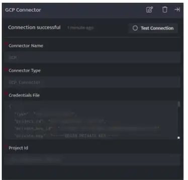

GCP (Google Cloud Platform) connector pulls the GCP activity logs from Google Cloud

###### **Pre-requisites**

- Create a Service account (if not already created)  
    Reference: [https://cloud.google.com/docs/authentication/getting-started#cloud-console](https://cloud.google.com/docs/authentication/getting-started#cloud-console)

- Create a key to access the GCP APIs by referring to the following link.[https://cloud.google.com/iam/docs/creating-managing-service-account-keys#iam-service-account-keys-create-console](https://cloud.google.com/iam/docs/creating-managing-service-account-keys#iam-service-account-keys-create-console).

- Enable data access logs if not activated by referring to the followinglink.[https://cloud.google.com/logging/docs/audit/configure-data-access](https://cloud.google.com/logging/docs/audit/configure-data-access)

###### **Configurations**

The following are the configurations to forward GCP logs to DNIF.

| **Field Name**  | **Description** |
| --- | --- |
| Connector Name | Enter a name for the connector |
| Connector Type | Enter GCP connector |
| Credentials File | Enter the details from credentials.json file, which is downloaded while configuring the reports API |
| Project Id | Enter the Project ID for which the logs will be fetched |

- Click **Save** after entering all the required details and click **Test Connection**, to test the configuration.

- A **Connection successful** message will be displayed on screen along with the time stamp.

- If the connection is not successful an error message will be displayed. Refer [Troubleshooting Connector Validations](https://dnif.it/kb/troubleshooting-and-debugging/troubleshooting-connector-validations/) for more details on the error message.

Once the connector is configured, validate if the connector is listed under **[Collection Status](https://dnif.it/kb/operations/collection-status/)** screen with status as **Active**. This signifies the connector is configured successfully and data is ready to ingest.
