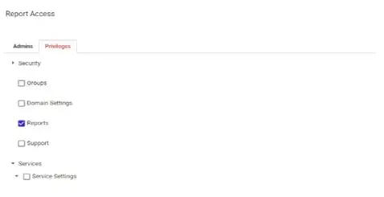
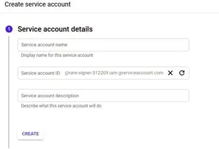
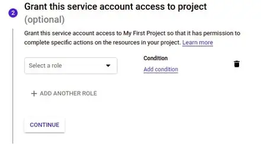
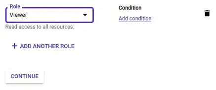
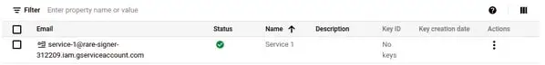
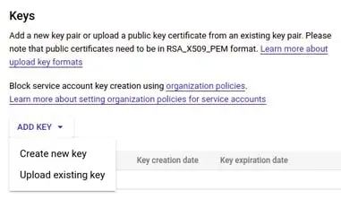
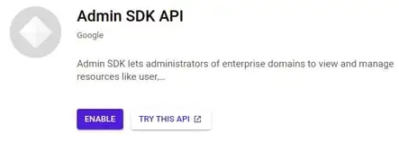
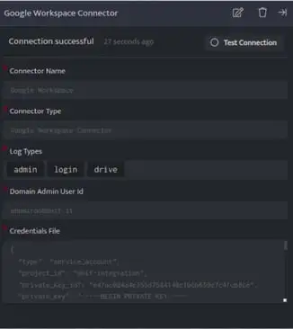

Imports your Google Workspace logs into DNIF. Upon enabling this integration, the connector uses the pull method to fetch logs from Google Workspace Report API

###### **Pre-requisites**

- Google Workspace User privileges

The user account only needs to have a role with **Reports** privilege to collect logs.

###### **1\. Create a Service Account**

- Go to your Google Workspace domain’s Google Cloud Platform (GCP) Console and sign in with the User.

- Select a **Project**. If you haven't used the Console before:
    - Agree to the Terms of Service and click **Create Project**.
    
    - Enter a project name and click **Create**.
    
    - Once the project is created, ensure the **Project** is selected.

- Click **Menu** on the top-left corner of the Google Cloud Platform (GCP) Console.

- Click **IAM & Admin > Service accounts**.  
      
    

- Click **+CREATE SERVICE ACCOUNT** and enter **Service Account Name** and **Service Account Description** details, click **CREATE**.

###### **2\. Grant Service Account Access to Project**

- Click **Select a Role** dropdown.

- Select the option **Project** and Click **Viewer** role.  
    

- Click **CONTINUE** and proceed.

- Click **Done**

###### **3.Create a key for the Service Account**

- Under **Actions** click ellipses corresponding to the required service account and select **Manage Keys**.

- Click **Add Key** dropdown and then select **Create new key**.

- Ensure that the key type is selected as **JSON**, click **Create**.

- A message pops up displaying  
    **Private Key saved to your computer**

-  Ensure you save the private key downloaded.

- Click **Close**, the private is downloaded.

###### **4\. Enable APIs for the service account**

- In the top-left corner of the Admin console, click **Menu** -> **APIs & Services** -> **Library**.

- Search for **Admin SDK API** and click **ENABLE**

###### **5\. Enable API permissions within Google Workspace By Super Admin**

- Sign in as the [**Administrator**](http://admin.google.com/) of the Google Workspace domain (Super Admin).

- From your **Google Workspace domain's Admin console**, go to the **Main menu** > **Security** > **Access and data control** > **API Controls**.

- In the **Domain Wide Delegation** pane, select **Manage Domain Wide Delegation**.

- Click **Add New**. In the **Client ID** field, enter the **service account's Client ID**. You can find your **service account's client ID** in the **json** file that was downloaded earlier.

- In **OAuth scopes** field enter the list of scopes that your application should be granted access to. In this case, add “[https://www.googleapis.com/auth/admin.reports.audit.readonly](https://www.googleapis.com/auth/admin.reports.audit.readonly)”

- Click **Authorize**.

###### **Configurations**

The following are the configurations to forward Google Workspace Connector logs to DNIF.‌

| **Field Name**  | **Description** |
| --- | --- |
| Connector Name | Enter a name for the connector |
| Connector Type | Enter Google Workspace connector |
| Log Types | Select the log types provided by google like admin, login, calendar, chat, meet, etc. |
| Domain Admin User ID | Super administrator account’s User ID |
| Credentials File | Enter the details from credentials.json file, which is downloaded while configuring the reports API |

- Click **Save** after entering all the required details and click **Test Connection**, to test the configuration.

- A **Connection successful** message will be displayed on screen along with the time stamp.

- If the connection is not successful an error message will be displayed. Refer [Troubleshooting Connector Validations](https://dnif.it/kb/troubleshooting-and-debugging/troubleshooting-connector-validations/) for more details on the error message.

Once the connector is configured, validate if the connector is listed under **[Collection Status](https://dnif.it/kb/operations/collection-status/)** screen with status as **Active**. This signifies the connector is configured successfully and data is ready to ingest.
