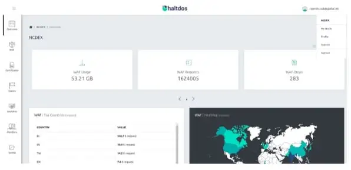
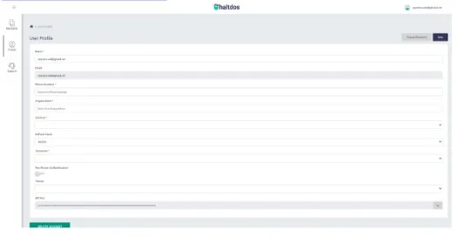
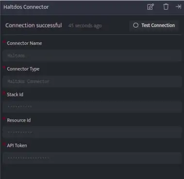

Haltdos connector fetches various types of WAF events triggered for a given Stack and Zone.

###### **Prerequisites**

- Stack ID

- Resource ID

- API token

###### **How to Create a Stack**

- In order to create a new stack, please contact [support@haltdos.com](mailto:).

- Once the stack has been issued, the user can view the stack in the Haltdos console. To access your stack,
    - Log in to your Haltdos account.
    
    - Click on the username at the top right side and click on My Stack in the drop-down menu.

###### **How to get the Stack Id and Resource Id?**

- In order to get the Stack Id and Resource Id, please contact [support@haltdos.com](mailto:).

###### **How to get the API Token**

- Click on the username at the top right side and click on Profile in the drop-down menu.

- Find the API Token and save it.  
      
      
    

###### **Configurations**

The following are the configurations to forward Haltdos Connector logs to DNIF.‌

| **Field** | **Description** |
| --- | --- |
| Connector Name | Enter a name for the connector |
| Connector Type | Enter Haltdos Connector |
| Stack ID | Enter your Haltdos stack id |
| Resource ID | Enter your Haltdos resource id |
| API Token | Enter API token |

- Click **Save** after entering all the required details and click **Test Connection**, to test the configuration.

- A **Connection successful** message will be displayed on screen along with the time stamp.

- If the connection is not successful an error message will be displayed. Refer [Troubleshooting Connector Validations](https://dnif.it/kb/troubleshooting-and-debugging/troubleshooting-connector-validations/) for more details on the error message.

Once the connector is configured, validate if the connector is listed under **[Collection Status](https://dnif.it/kb/operations/collection-status/)** screen with status as **Active**. This signifies the connector is configured successfully and data is ready to ingest.
