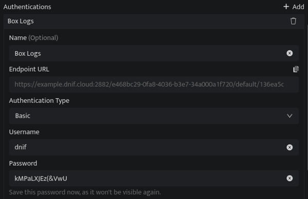
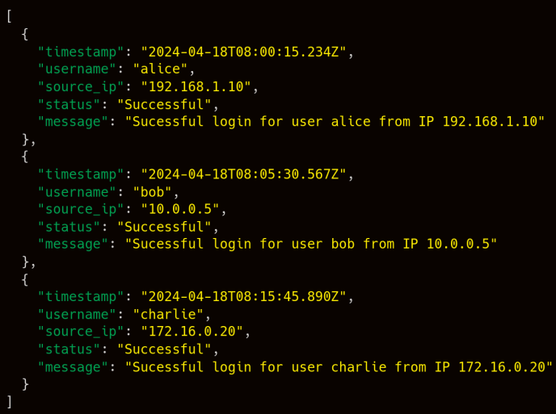
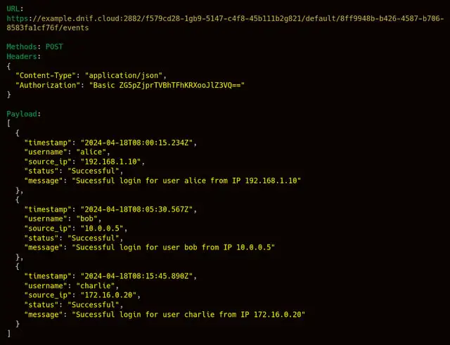
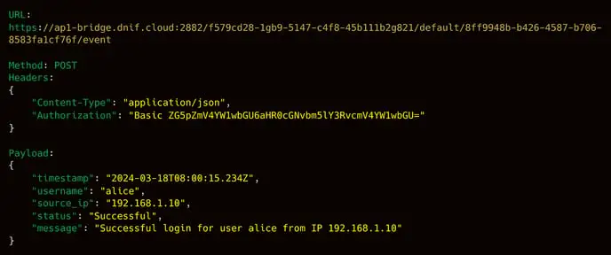
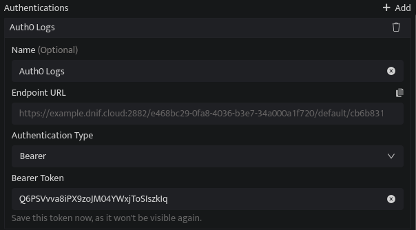
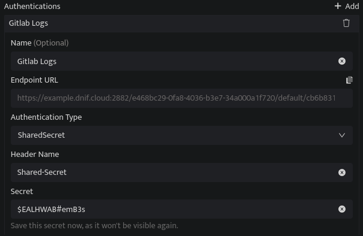
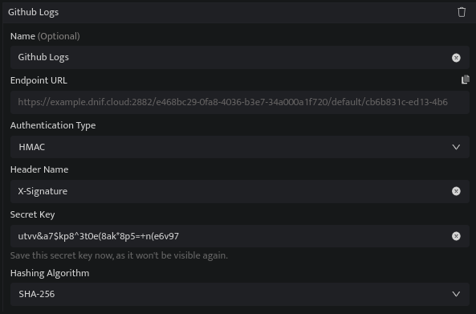

HTTP Connector can receive logs from various devices and log sources via HTTPS connection.

**IMPORTANT NOTE: Please note that you can create only ONE HTTP connector. If you need to integrate with multiple devices using the HTTP connector, please add a different authentication block for each device within the same HTTP connector.**

###### **Authentication:**

To secure HTTPS endpoint, ensure it only processes requests from authenticated sources.  We offer the following modes of authentication:

- Basic  
    With basic authentication, define the username and password during the setup. The entity making the POST request to DNIF must include a header of the format Authorization: Basic &lt;base64_string&gt;. The string after the Basic keyword follows RFC 7617, which means the sender must encode the value of username:password using base64. DNIF only accepts requests with a matching username and password.

- Bearer  
    With bearer authentication, define the bearer token value during the setup. The entity making the POST request to DNIF must include a header of the format Authorization: Bearer &lt;token_value&gt;. DNIF will only accept requests with matching bearer tokens.

- Shared Secret  
    With shared secret authentication (token authentication), configure the header name and shared secret value during the setup. The entity making the POST request to DNIF must include the same header name and shared secret value in its request header. DNIF will only accept payloads with headers and secrets that match your configuration.  
      
    This method is called shared-secret because the secret is shared between DNIF and the entity making the POST request.  
    **e.g.** a third-party SaaS tool emitting log events.

- HMAC  
    With HMAC authentication, configure the header name and secret key value during the setup. The entity making the POST request to DNIF must hash the payload using the hashing algorithm and secret key specified. This signature is then included in the header. On receiving the request, DNIF will then independently hash the payload using the same hashing algorithm and secret key. Only requests with matching signatures will be accepted.  
    

###### **Supported Log Formats:**

Currently, we support logs in the following formats:

- JSON

- New line separated JSON string/string

###### **Create a connector:**

Follow the steps below to create an HTTP connector:

- Fill out the connector form, enter the **Connector Name**

- A single HTTP connector supports multiple modes of authentication. So, instead of creating different connectors for different log sources, you should create a single HTTP connector with multiple authentication modes and then use an authentication mode-specific **Endpoint URL** to send the logs to DNIF.

- Click the Add button to add an authentication mode.  
      
    

- Once the authentication mode is added, you can change the authentication type and modify the authentication mode-specific fields. To add multiple authentication modes, click the Add button and modify the added authentication mode as per your requirements.  
      
    

  

- See the table at the end for the **Authentication mode-specific fields** section.

- Once you have added and modified the authentication mode, copy the Endpoint URL and use this copied URL to ingest logs to DNIF via this authentication method.  
    **Note**: Please refer to the next section on how to use this copied URL and send logs to DNIF.

- Click the **Next** button to create the connector.

###### **Sending data to DNIF:**

We support 2 methods for forwarding logs through the HTTP connector. 

- Bulk logs

- Single log

To send the logs we need a URL. Once you have copied the Endpoint URL from the authentication mode, the URL will be in the following format.

- **Bulk logs**  
    Using bulk logs API endpoint, you can forward logs in a bunch. Multiple logs can be forwarded at a time.

1. **URL**: https://example.dnif.cloud:2882/f579cd28-1gb9-5147-c4f8-45b111b2g821/default/8ff9948b-b426-4587-b706-8583fa1cf76f/events  
    **Note:** The URL for bulk logs ends with /events

3. **Method:** POST

5. **Headers:** The header's value would differ depending on the current authentication mode. Please refer to the Authentication Section above for the header value. The common header would be "Content-Type": "application/json"  
      
      
      
      
    

7. **Payload:**  
      
      
      
      
    

9. Sample:  
      
    

- **Single Log**  
    Using the single log API endpoint, you can forward a single log event at a time.

1. **URL:**https://example.dnif.cloud:2882/f579cd28-1gb9-5147-c4f8-45b111b2g821/default/8ff9948b-b426-4587-b706-8583fa1cf76f/event  
    **Note:** The URL for a single log ends with /event

3. **Method**: POST

5. **Headers:** The header's value would differ depending on the current authentication mode. Please refer to the Authentication Section above for the header value.  
      
      
      
      
    

7. **Payload:**  
      
    

5\. Sample:  
  

###### **Configurations**

- Using the HTTP Connector, follow the configuration requirements to forward logs to DNIF.

| **Field** | **Description** |
| --- | --- |
| Connector Name | Enter a name for the connector |
| Authentications | Add various Authentication modes to be supported. Please see below for the available authentication modes |
| Number of Workers | Number of threads to publish logs |

**Authentication mode-specific fields:**

All the Authentication modes have the following common field irrespective of the Authentication mode.

| **Field** | **Description** |
| --- | --- |
| Name | The name of the Authentication mode for reference |
| Endpoint URL | The generated endpoint URL for specific Authentication Mode. |
| Authentication Type | Authentication modes. Either of **'Basic'**, **'Bearer'**, **'SharedSecret'**, **'HMAC'** |

  
**Basic:**  

| **Field** | **Description** |
| --- | --- |
| Username | Enter a Username.   **Note:** Save this username safely as it will be used for authentication. |
| Password | Enter a Password. **Note:** Save this password safely as it will be used for authentication. |

**Bearer:**

| **Field** | **Description** |
| --- | --- |
| Bearer token | Enter a Token(Password). **Note:** Save this token safely as it will be used for authentication. |

**Shared Secret:**  

| **Field** | **Description** |
| --- | --- |
| Header Name | Enter a Header Name. **Note:** Include this header in the Authentication request. |
| Secret | Enter a Secret. **Note:** Save this Secret safely as it will be used for authentication. |

**HMAC:**  

| **Field** | **Description** |
| --- | --- |
| Header Name | Enter a Header Name. **Note:** Include this header in the Authentication request. |
| Secret Key | Enter a Secret Key. **Note:** Use this Secret Key to hash the request payload |
| Hashing Algorithm | Select a Hashing Algorithm for generating the signature |

The following optional configurations can be done based on requirements.

| **Field** | **Description** |
| --- | --- |
| Log Level | Set the loglevel0: DEBUG1: INFO4: WARNING5: ERROR6: CRITICAL |
| Number of Threads  | Number of threads to publish logs |
| Size limit  | Size limit for creating bunching of logs to be sent |
| Wait Time | Max time to wait for log bunching in seconds |
