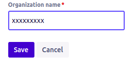

Jira connector uses the pull method to fetch audit logs using the Jira Cloud platform REST API. All Jira products are on free plans. Audit logs are available when at least one Jira product is on a paid plan. DNIF can collect, normalize, and monitor Jira logs to help you identify abnormal activity within your Jira account in real time.

###### **Prerequisites**  

- Need at least one paid plan of Jira service.

- API Token

- Organization Name

- Jira UserName or Email ID

###### **Generate an API token**

- **NOTE**: While logged in to Jira as a user with the Admin role, go to the Jira roles page and verify that your Jira user account has the following required permissions:
    - Administer Jira: Granted by the Jira Administrator's global permission.
    
    - OAuth 2.0 scopes required:
        - Classic(Recommended): **manage:jira-configuration**
        
        - Granular: **read:audit-log:jira, read:user:jira**

- Sign in to your Atlassian Jira account using the following link  
    [https://id.atlassian.com/manage-profile/security/api-tokens.](https://id.atlassian.com/manage-profile/security/api-tokens.)

- Click **Create API token**.

- Enter a memorable and concise Label for your token from the dialog that appears and click Create.

- Click copy button, then paste the token to your script, or elsewhere to save:  
      
    

- **Note**: For security reasons, it isn't possible to view the token after closing the creation dialog. You should store the token securely, just as for any password.

###### **Get Organization name**

- In the top left corner of Atlassian Account, click on the dotted square box, then click Administration.  
      
    

- In the top header click on **More** then click on **Settings**.  
      
    

- In the **Details** tab find your Organization Name and copy the name.  
      
      
    

###### **Configurations**

- The following are the configurations to forward Jira Connector logs to DNIF.‌  
      
      
      
      
    

| **Field** | **Description** |
| --- | --- |
| Connector Name | Enter a name for the connector |
| User Name or Email ID | Enter User Name or Email ID |
| API Key | Enter the API Key of Jira |
| Organization | Enter organization name of Jira |

- Click **Save** after entering all the required details and click **Test Connection**, to test the configuration.

- A **Connection successful** message and the time stamp will be displayed on a screen.

- If the connection is not successful an error message will be displayed. Refer to [Troubleshooting Connector Validations](https://dnif.it/kb/troubleshooting-and-debugging/troubleshooting-connector-validations/) for more details on the error message.

Once the connector is configured, validate if the connector is listed under [**Collection Status**](https://www.dnif.it/en/kb/collection-status) screen with status as **Active**. This signifies the connector is configured successfully and data is ready to ingest.
