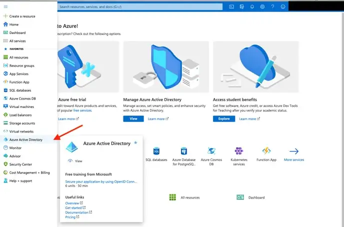
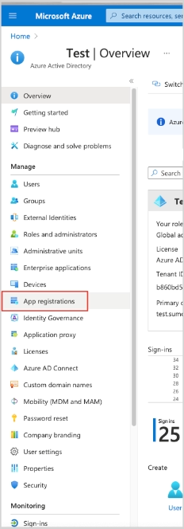
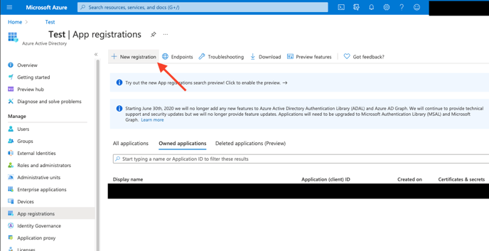
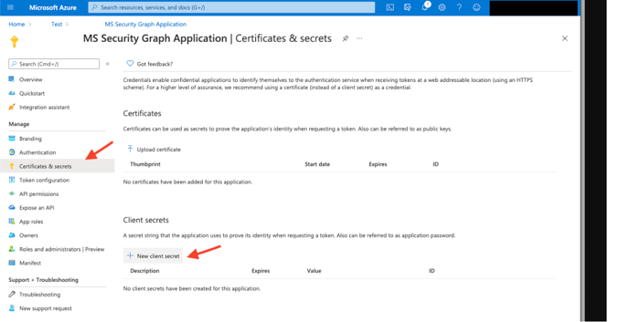
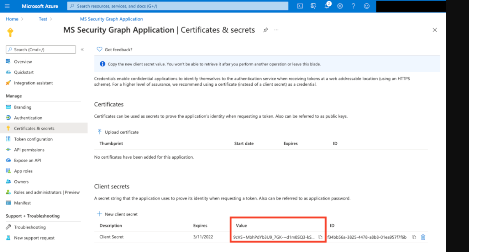
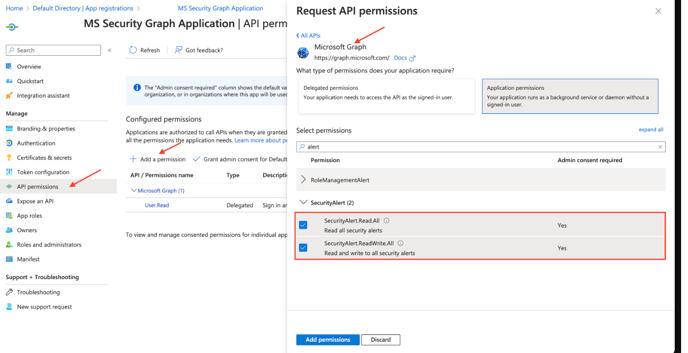
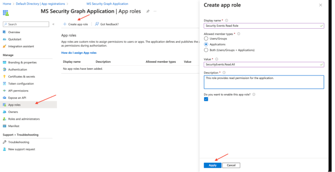
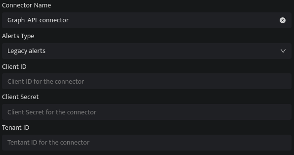

The Microsoft Graph Security API (Graph API) Connector provides a secure endpoint to receive [alerts](https://learn.microsoft.com/en-us/graph/api/resources/security-alert?view=graph-rest-1.0) from the Microsoft Graph [Security API endpoint](https://learn.microsoft.com/en-us/graph/api/security-list-alerts_v2?view=graph-rest-1.0). DNIF can collect, normalize, and monitor alerts logs to help you identify suspicious activity within your workspace in real time.

###### **Pre-requisites**

- Client ID

- Client Secret

- Tenant ID

###### **Steps to derive prerequisites:**

1. Log into the [Azure Active Directory Portal](https://aad.portal.azure.com/).

3. Select Azure Active Directory in the left menu



3\. Select **App Registrations**.



4\. Select **New Registration**. Go through the [registration process](https://docs.microsoft.com/en-us/graph/auth-register-app-v2), providing a name for the application. Selecting **Accounts in this organizational directory only is sufficient.**



**5.** After the application is registered ensure you copy the **Application (client) ID and Directory (tenant) ID** displayed on the **Overview page.** These are needed when configuring the Microsoft Graph Security API (Graph API) connector.


6\. Within the application configuration page, select Certificates and Secrets and create an [Application Client Secret Key](https://docs.microsoft.com/en-us/graph/notifications-integration-app-registration#app-certificates-and-secrets).



7\. Copy the Client Secret value, you'll need it when configuring the Microsoft Graph Security API (Graph API) connector.



  
  
8\. Request the appropriate [permissions for the application](https://docs.microsoft.com/en-us/azure/active-directory/develop/quickstart-configure-app-access-web-apis#application-permission-to-microsoft-graph). Click on **API Permissions**, then **Add a permiss**  
**ion** and select **Microsoft Graph**.

You need to find and select the permissions.

```
SecurityAlert.Read.All, SecurityAlert.ReadWrite.All,SecurityIncident.Read.All,SecurityIncident.ReadWrite.All, Directory.Read.All,AuditLog.Read.All, SecurityEvents.Read.All
```

See [this list](https://docs.microsoft.com/en-us/graph/permissions-reference#security-permissions) to view all available security permissions.

**NOTE:**  An Administrator must approve (grant) these permissions before the Source will function.



9\. Follow the steps below to enable the Application permission role.

1. 1. In the Manage menu, select App roles.Click the **Create app role** tab.
        
        1. **Display name**. Enter the display name for the role.**Allowed member types**. Select Applications as the allowed member type.**Value**. Enter SecurityAlert.Read.All as the value.**Description**. Enter a brief description.Select the checkbox to enable the app role.
        
        Click **Apply**.
    
      
    

###### **Configurations**

The following are the configurations to forward Microsoft Graph Security API (Graph API) Connector logs to DNIF.‌



| **Field Name**  | **Description** |
| --- | --- |
|  Connector Name |  Enter a name for the connector |
|  Alerts Type |  Select Graph API Security alerts Type |
|  Client ID |  Enter the Client ID |
|  Client Secret |  Enter the Client Secret |
|  Tenant ID |  Enter the Tenant ID |

- Click **Save** after entering all the required details and click **Test Connection**, to test the configuration.

- A **Connection successful** message will be displayed on screen along with the time stamp.

If the connection is not successful an error message will be displayed. Refer [Troubleshooting Connector Validations](https://dnif.it/kb/troubleshooting-and-debugging/troubleshooting-connector-validations/) for more details on the error message.
