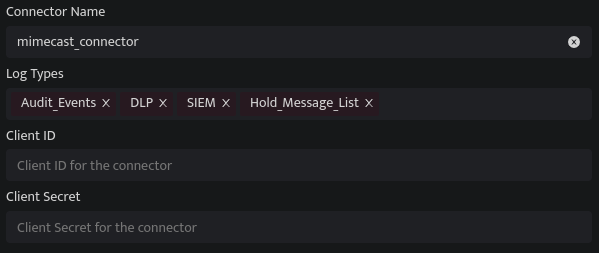

The Mimecast connector supports collecting SIEM, DLP, Audit, and Hold Message List data from the [Mimecast API](https://developer.services.mimecast.com/apis). DNIF can collect, normalize, and monitor Mimecast logs to help you identify suspicious activity within your workspace in real time.

###### **Pre-requisites**

- Client ID

- Client Secret

###### **Steps to derive prerequisites:**

- **NOTE:** The user account associated with your Mimecast credentials needs to have basic administrator access

1. [Application Registration](https://developer.services.mimecast.com/api-overview#application-registration-credential-management) [and API Credential Management](https://developer.services.mimecast.com/api-overview#application-registration-credential-management):

- For Email Security Cloud Gateway customers: 

Follow this document [Email Security Cloud Gateway](https://community.mimecast.com/s/article/api-integrations-managing-api-2-0-for-cloud-gateway).

- For Email Security Cloud Integrated customers: 

Follow this document [Email Security Cloud Integrated](https://community.mimecast.com/s/article/api-integrations-managing-api-2-0-for-cloud-integrated).

1. To get the following log sources from Mimecast kindly allow the respective permission:

- [SIEM Logs](https://developer.services.mimecast.com/docs/threatssecurityeventsanddataforcg/1/routes/siem/v1/events/cg/get) - In order to use this endpoint the logged in user must be a Mimecast Administrator with atleast the **Security Events and Data Retrieval | Threat and Security Events (SIEM) | Read permission**.  
    Allow Logging by following this document ([https://developer.services.mimecast.com/siem-guidelines](https://developer.services.mimecast.com/siem-guidelines))

- [DLP Logs](https://developer.services.mimecast.com/docs/securityevents/1/routes/api/dlp/get-logs/post) - In order to successfully use this endpoint the role assigned to the app must have at least the following level of application permissions granted **Monitoring | Data Leak Prevention | Read**.

- [Audit Events](https://developer.services.mimecast.com/docs/auditevents/1/routes/api/audit/get-audit-events/post) - In order to successfully use this endpoint the role assigned to the app must have at least the following level of application permissions granted **Account | Logs | Read**.

- [Hold Message List](https://developer.services.mimecast.com/docs/cloudgateway/1/routes/api/gateway/get-hold-message-list/post) - In order to successfully use this endpoint the role assigned to the app must have at least the following level of application permissions granted **Account | Dashboard | Read**.

###### **Configurations**

The following are the configurations to forward Mimecast Connector logs to DNIF.‌

| **Field Name**  | **Description** |
| --- | --- |
| Connector Name | Enter a name for the connector |
| Log Types | Enter Mimecast Log Types |
| Client ID | Enter the Mimecast API Client ID |
| Client Secret | Enter the Mimecast API Client Secret |

- Click **Save** after entering all the required details and click **Test Connection**, to test the configuration.

- A **Connection successful** message will be displayed on screen along with the time stamp.

- If the connection is not successful an error message will be displayed. Refer [Troubleshooting Connector Validations](https://dnif.it/kb/troubleshooting-and-debugging/troubleshooting-connector-validations/) for more details on the error message.

Once the connector is configured, validate if the connector is listed under **[Collection Status](https://dnif.it/kb/operations/collection-status/)** screen with status as **Active**. This signifies the connector is configured successfully and data is ready to ingest.
