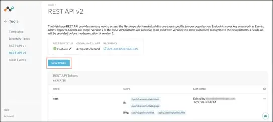
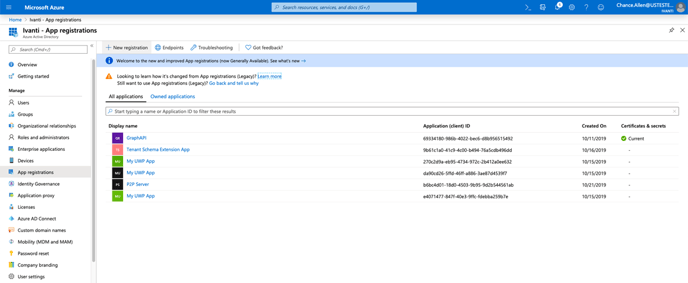
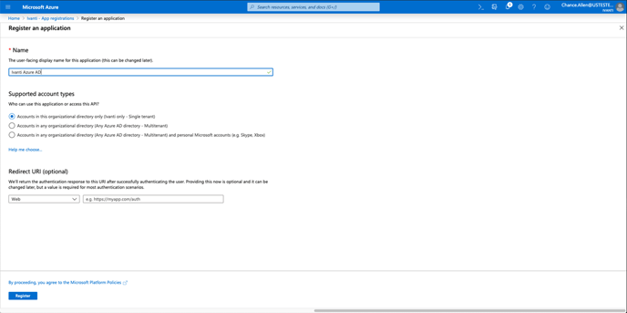
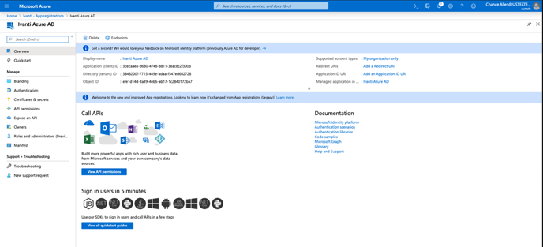

Netskope One is a cloud-based platform that provides integrated security and networking solutions, supporting your transition to Secure Access Services Edge (SASE) and Zero Trust principles. DNIF can collect, normalize, and monitor Netskope logs to help you identify abnormal activity within your Snyk account in real-time.

###### **Prerequisites**  

- Tenant Url

- API Token

**Note:-** A user with the Netskope Administrator role is necessary.

###### **Generate an API token**

- Navigate to Settings > Tools > REST API v2 > New Token. The Create REST API Token window displays.

- Click the **Add Endpoint** dropdown and select the “**_/api/v2/events/token/transaction\_events”_** for transaction events and “**_api/v2/events/dataexport/events/alert”_** for alerts events endpoint with read privilege.

- Create the API token.  
      
    

- Select the Read radio button in the Privilege column.

- Click **Save**. A confirmation box displays stating the token creation is successful.  
      
      
      
    

- Click **COPY TOKEN** to save it for later use.  
    **Configurations**

- The following are the configurations to forward Netskope Connector logs to DNIF.‌

| **Field** | **Description** |
| --- | --- |
| Connector Name | Enter a name for the connector |
| Tenant Domain | Enter the Tenant Domain. |
| API Token | Enter the API Token. |
| Log Types | Select the log type from which you want to pull logs. |

- Click **Save** after entering all the required details and click **Test Connection**, to test the configuration.

- A **Connection successful** message and the time stamp will be displayed on a screen.  
    If the connection is not successful an error message will be displayed.Refer to [Troubleshooting Connector Validations](https://dnif.it/kb/troubleshooting-and-debugging/troubleshooting-connector-validations/) for more details on the error message.

Once the connector is configured, validate if the connector is listed under **[Collection Status](https://dnif.it/kb/operations/collection-status/)** screen with status as **Active**. This signifies the connector is configured successfully and data is ready to ingest.
