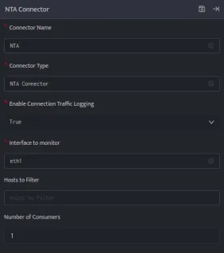

Network traffic analysis (NTA) is a method of monitoring network availability and activity to identify anomalies, including security and operational issues. Common use cases for NTA include:

- Collecting a real-time and historical record of what’s happening on your network.

- Troubleshooting a slow network

- Improving internal visibility and eliminating blind spots

The NTA Connector is used to gain an insight into all the traffic flowing through the setup network and fetch logs for different protocols, connections, etc. while listening on a particular network interface of the host system on which it is deployed. These include all HTTP sessions with their requested URIs, key headers, MIME types, and server responses; DNS requests with replies; SSL certificates; key content of SMTP sessions; and much more.

By default, the Syslog traffic and the Connection traffic on the host system where the connector is deployed is filtered out to reduce noise in the log collection. This helps to capture events for critical protocols for network security monitoring.  
Configurations

###### **Benefits of NTA**

- Improved visibility into devices connecting to your network (e.g. IoT devices, healthcare visitors)

- Meet compliance requirements

- Troubleshoot operational and security issues

- Respond to investigations faster with rich detail and additional network context

NTA by itself does not pull logs from any other host systems, it ingests the logs received on an NIC card on Adapter. For example: You can configure a dedicated and separate NIC as NTA for capturing span traffic on Adapter.

###### **Configurations**

The following are the configurations to fetch Network Traffic logs on DNIF.‌

1. Follow the initial configuration steps in [Connector Configurations](https://dnif.it/kb/connectors/how-to-configure-connectors/)  
      
      
      
    

3. Click edit icon on the above screen and enter the following details.  
    Field NameDescriptionConnector NameEnter a name for the connectorConnector TypeEnter NTA connectorEnable Connection LoggingEnable connection logs generated on host systemInterface to MonitorNetwork Interface on host to monitor network trafficHosts to FilterList of Hosts to filter network traffic to and from particular hostsNumber of ConsumersNumber of consumer processes to run for the network traffic log consumption

5. Enter the above details and click **Save**.

Once the connector is configured, validate if the connector is listed under **[Collection Status](https://dnif.it/kb/operations/collection-status/)** screen with status as **Active**. This signifies the connector is configured successfully and data is ready to ingest.
