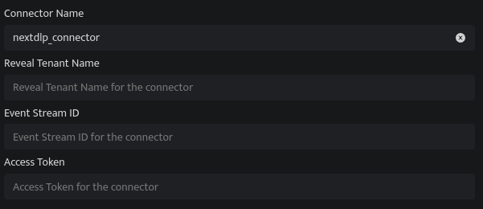

The NextDLP Reveal connector provides a simple way to connect to your Reveal tenant so that detection, incident, and audit log events can be pulled into DNIF.

Leverage detections to gain insight into unauthorized and unusual user activities on endpoints and strengthen your data loss prevention strategy. Use incidents to cut down triage and investigation time by viewing detections that have been grouped together because they have the same root cause. Access audit logs to capture details about operator interactions with the Reveal UI and Reveal API, providing you with important compliance and security information for your organization.

###### **Pre-requisites**

- Tenant Name

- Stream ID

- Access Token

###### **Steps to derive prerequisites:**

- NOTE: The NextDLP Reveal API documentation is not public and can only be accessed by partners or customers.

1. Log in to your Reveal tenant URL e.g. [https://examplecompany.reveal.nextdlp.com](https://examplecompany.reveal.nextdlp.com/)

3. Open the Admin tab on the About page

5. The documentation link should be the first visible link

7. Alternatively, if already logged in as an operator, visit the documentation directly via: [https://examplecompany.reveal.nextdlp.com/api/docs/content/home.htm](https://examplecompany.reveal.nextdlp.com/api/docs/content/home.htm) 

###### **Configurations**

The following are the configurations to forward NextDLP Reveal Connector logs to DNIF.‌

| **Field Name**  | **Description** |
| --- | --- |
|   Connector Name | Enter a name for the connector |
|   Reveal Tenant Name | Enter the Reveal Tenant Name |
|   Event Stream ID | Enter the Event Stream ID |
|   Access Token | Enter the Access Token |

- Click **Save** after entering all the required details and click **Test Connection**, to test the configuration.

- A **Connection successful** message will be displayed on screen along with the time stamp.

- If the connection is not successful an error message will be displayed. Refer [Troubleshooting Connector Validations](https://dnif.it/kb/troubleshooting-and-debugging/troubleshooting-connector-validations/) for more details on the error message.

Once the connector is configured, validate if the connector is listed under **[Collection Status](https://dnif.it/kb/operations/collection-status/)** screen with status as **Active**. This signifies the connector is configured successfully and data is ready to ingest.
