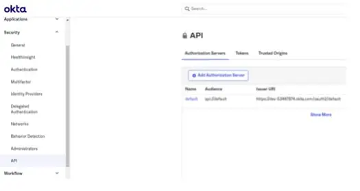
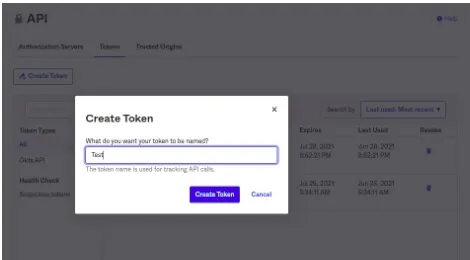
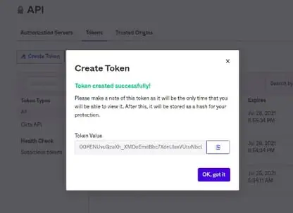
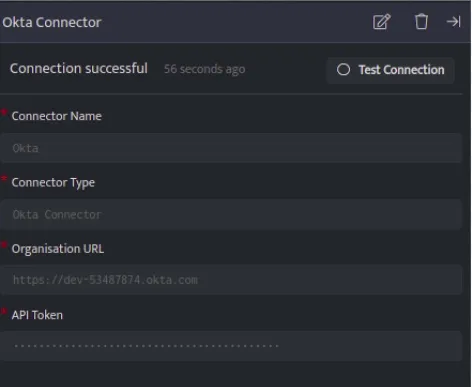

Okta connector pulls system events that are related to your organization in order to provide an audit trail that can be used to understand platform activity and to diagnose problems.

###### **Pre-requisites**

- Okta organisation URL

- API token (preferably from a service account)

###### **Create an Authentication token**

Log in to your Okta account, move to the security section on the left navigation bar and then click on API.

Go to the tokens tab and create the api token and store it for future reference.  

###### **Configurations**

The following are the configurations to forward Okta Connector logs to DNIF.‌

| **Field** | **Description** |
| --- | --- |
| Connector Name | Enter a name for the connector |
| Connector Type | Enter Okta Connector |
| Organisation URL | Enter your Okta organisation URL |
| API Token | Enter API token |

- Click **Save** after entering all the required details and click **Test Connection**, to test the configuration.

- A **Connection successful** message will be displayed on screen along with the time stamp.

- If the connection is not successful an error message will be displayed. Refer [Troubleshooting Connector Validations](https://dnif.it/kb/troubleshooting-and-debugging/troubleshooting-connector-validations/) for more details on the error message.

Once the connector is configured, validate if the connector is listed under **[Collection Status](https://dnif.it/kb/operations/collection-status/)** screen with status as **Active**. This signifies the connector is configured successfully and data is ready to ingest.
