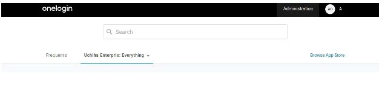
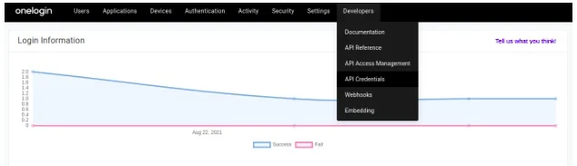
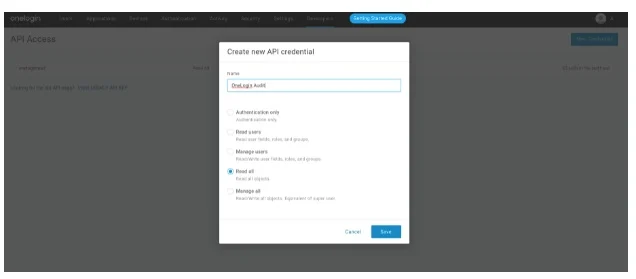
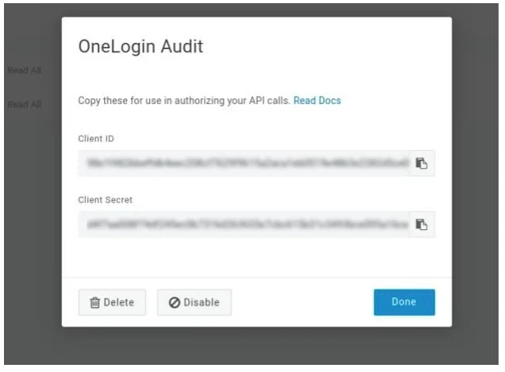
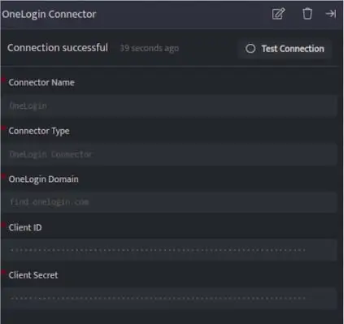

OneLogin connector pulls audit events in order to gather, analyze, and display your events generated by OneLogin Account.

###### **Prerequisites**  

- OneLogin Domain

- API Credentials (Client ID and Client Secret)

###### **Create API Credentials**

- Log in to your OneLogin account, move to the administration section on the top navigation bar.  
      
      
      
      
    

- Go to the developer's tab and click on API Credentials.  
      
      
      
      
      
    

- Click on New Credentials and give it a name of your choice with Read All permissions and click Save.  
      
      
      
      
    

- Take note of your Client ID and Client Secret.  
      
      
      
      
    

###### **Configurations**

- The following are the configurations to forward OneLogin Connector logs to DNIF.‌  
      
    

| **Field** | **Description** |
| --- | --- |
| Connector Name | Enter a name for the connector |
| Connector Type | Enter OneLogin Connector |
| OneLogin Domain | Enter your OneLogin organization domain |
| Client ID | Enter Client ID |
| Client Secret | Enter Client Secret |

- Click **Save** after entering all the required details and click **Test Connection**, to test the configuration.

- A **Connection successful** message will be displayed on screen along with the time stamp.

- If the connection is not successful an error message will be displayed. Refer [Troubleshooting Connector Validations](https://dnif.it/kb/troubleshooting-and-debugging/troubleshooting-connector-validations/) for more details on the error message.

Once the connector is configured, validate if the connector is listed under **[Collection Status](https://dnif.it/kb/operations/collection-status/)** screen with status as **Active**. This signifies the connector is configured successfully and data is ready to ingest.
