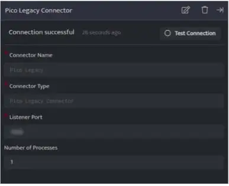

PICO Connector is used to receive logs from one or multiple PICO at a remote location. The PICO Connector is configured and running by default on port 7426 TCP when the Adapter is onboarded into the DNIF tenants (previously known as cluster).

PICO legacy Connector is used to maintain backward compatibility with PICO v6.

###### **Pre-requisites**

Ensure that the port where PICO is forwarding logs is open and is not occupied by some other service to enable forwarding of log events.

The following are the configurations to forward PICO Connector logs to DNIF.‌

| **Field Name** | **Description** |
| --- | --- |
| Connector Name | Enter a name for the connector |
| Connector Type | Enter PICO connector |
| Listener Port | Enter the port number at which you want to start the connector |
| Number of Processes | Number of processes to run for the connector |

- Click **Save** after entering all the required details and click **Test Connection**, to test the configuration.

- A **Connection successful** message will be displayed on screen along with the time stamp.

- If the connection is not successful an error message will be displayed. Refer [Troubleshooting Connector Validations](https://dnif.it/kb/troubleshooting-and-debugging/troubleshooting-connector-validations/) for more details on the error message.

Once the connector is configured, validate if the connector is listed under **[Collection Status](https://dnif.it/kb/operations/collection-status/)** screen with status as **Active**. This signifies the connector is configured successfully and data is ready to ingest.
