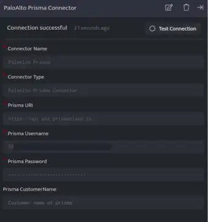

###### **Overview**

Prisma Cloud is the industry's most comprehensive cloud native security platform (CNSP), with the industry's broadest security and compliance coverage for users, applications, data, and the entire cloud native technology stack throughout the development lifecycle and across hybrid and multi-cloud environments.

The Prisma Alerts connector fetches the alerts generated by Prisma Cloud when it detects a violation in a policy that is included in an active alert rule.

**Reference:**  
[https://api.docs.prismacloud.io/reference#alerts](https://api.docs.prismacloud.io/reference#alerts)

###### **Pre-requisites**

1. Connectivity with Prisma Cloud API using valid credentials.

3. Required credentials:
    - Username
    
    - Password
    
    - CustomerName

**CustomerName** is required only if you are a multi-tenant user and the body parameters of your login call include a username and password instead of an access key ID and secret key, then you will also need to provide the customerName. Otherwise it is not required.

Reference to create credentials: [https://docs.paloaltonetworks.com/prisma/prisma-cloud/prisma-cloud-admin/manage-prisma-cloud-administrators/create-access-keys.html](https://docs.paloaltonetworks.com/prisma/prisma-cloud/prisma-cloud-admin/manage-prisma-cloud-administrators/create-access-keys.html)

###### **Configurations**

The following are the configurations to forward Prisma Alerts Connector logs to DNIF.‌

| **Field Name** | **Description** |
| --- | --- |
| Connector Name | Enter a connector name |
| Connector Type | Enter prisma\_alerts\_connector |
| Prisma URI | Enter Prisma Cloud API URI |
| Prisma Username | Enter Username/access key ID to access the API |
| Prisma Password | Enter Password/secret key to access the API |
| Prisma CustomerName | Enter CustomerName if Prisma login requires it, else keep blank |

- Click **Save** after entering all the required details and click **Test Connection**, to test the configuration.

- A **Connection successful** message will be displayed on screen along with the time stamp.

- If the connection is not successful an error message will be displayed. Refer [Troubleshooting Connector Validations](https://dnif.it/kb/troubleshooting-and-debugging/troubleshooting-connector-validations/) for more details on the error message.

Once the connector is configured, validate if the connector is listed under **[Collection Status](https://dnif.it/kb/operations/collection-status/)** screen with status as **Active**. This signifies the connector is configured successfully and data is ready to ingest.
