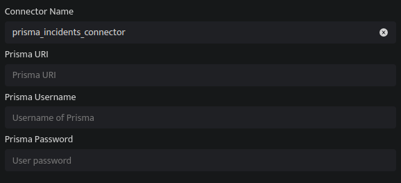

###### **Overview**

Prisma Cloud is the industry's most comprehensive cloud native security platform (CNSP), with the industry's broadest security and compliance coverage for users, applications, data, and the entire cloud native technology stack throughout the development lifecycle and across hybrid and multi-cloud environments.

The Prisma Incidents connector fetches the Incidents generated by Prisma Cloud. Prisma Cloud Compute analyzes individual audits and correlates them together to surface unfolding attacks. These chains of related audits are called incidents.

**Reference**:  
[https://pan.dev/prisma-cloud/api/cwpp/get-audits-incidents/](https://pan.dev/prisma-cloud/api/cwpp/get-audits-incidents/)

###### **Pre-requisites**

- Username

- Password

- Prisma URI

###### **Steps to derive prerequisites:**

- **Reference to create credentials**: [https://docs.paloaltonetworks.com/prisma/prisma-cloud/prisma-cloud-admin/manage-prisma-cloud-administrators/create-access-keys.html](https://docs.paloaltonetworks.com/prisma/prisma-cloud/prisma-cloud-admin/manage-prisma-cloud-administrators/create-access-keys.html)

###### **Configurations**

The following are the configurations to forward Prisma Incidents Connector logs to DNIF.‌

| **Field Name**  | **Description** |
| --- | --- |
|  Connector Name |  Enter a name for the connector |
|  Prisma URI |  Enter address for Prisma Cloud   Console |
|  Prisma Username |  Enter Username/access key ID to   access the API |
|  Prisma Password  |  Enter Password/secret key to access the API |

- Click **Save** after entering all the required details and click **Test Connection**, to test the configuration.

- A **Connection successful** message will be displayed on screen along with the time stamp.

- If the connection is not successful an error message will be displayed. Refer [Troubleshooting Connector Validations](https://dnif.it/kb/troubleshooting-and-debugging/troubleshooting-connector-validations/) for more details on the error message.

Once the connector is configured, validate if the connector is listed under **[Collection Status](https://dnif.it/kb/operations/collection-status/)** screen with status as **Active**. This signifies the connector is configured successfully and data is ready to ingest.
