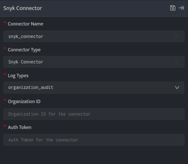

Snyk connector uses the pull method to fetch audit logs using the Snyk REST API. DNIF can collect, normalize, and monitor Snyk audit logs to help you identify abnormal activity within your Snyk account in real time.

**Note:-** Note that a latency of up to 24 hours is possible due to Snyk Audit and Group log pagination. To avoid duplicate or lost data, DNIF pulls Snyk logs once a day.

###### **Prerequisites**  

- API Token

- Organization ID

- Group ID

**Note:-** A user with the Snyk Group Administrator and Organization Administration role is necessary.

###### **Generate an API token**

- Log in to your [Snyk account](https://app.snyk.io/account).

- Go to **Account Settings > General.**

Locate the "Auth Token" section. In the KEY field, click **“click to show”**, then select and copy the value in that field. Store this in a secure location, as you will need it in the next steps.

**Get an Organization ID and Group ID.**

- Go to **Organization setting > General.**

- In the **Organization ID** field, Click on **Copy.**

- Go to **Group setting > General.**

- In the **Group ID** field, Click on **Copy.**

###### **Configurations**

The following are the configurations to forward Snyk Connector logs to DNIF.‌

| **Field** | **Description** |
| --- | --- |
| Connector Name | Enter a name for the connector. |
| Log Types | Select the log type from which you want to fetch the logs. |
| Organization ID | Enter the Organization ID. (Optional according to the selected log type). |
| Group ID | Enter Group ID. (Optional according to the selected log type). |
| Authentication Token | Enter the Authentication  token. |

- Click **Save** after entering all the required details and click **Test Connection**, to test the configuration.

- A **Connection successful** message and the time stamp will be displayed on a screen.

- If the connection is not successful an error message will be displayed. Refer to [Troubleshooting Connector Validations](https://dnif.it/kb/troubleshooting-and-debugging/troubleshooting-connector-validations/) for more details on the error message.

Once the connector is configured, validate if the connector is listed under **[Collection Status](https://dnif.it/kb/operations/collection-status/)** screen with status as **Active**. This signifies the connector is configured successfully and data is ready to ingest.
