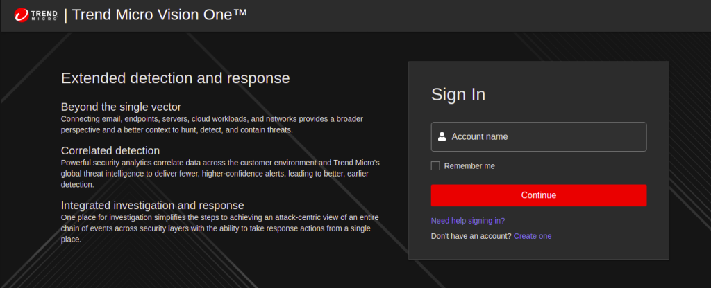
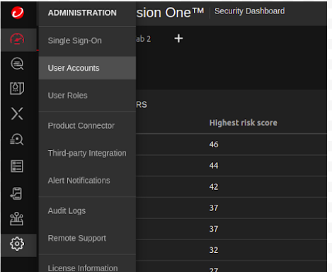
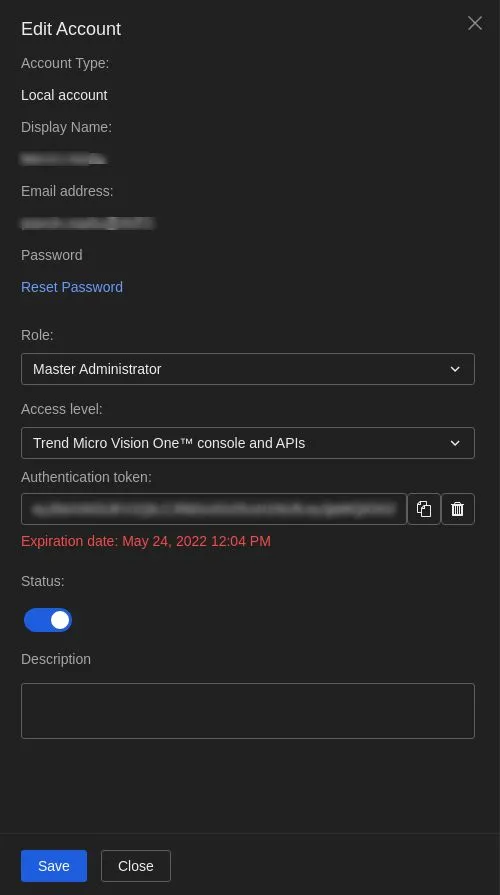
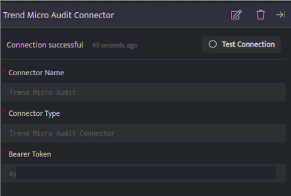

Trend Micro Audit connector uses the pull method to fetch audit logs using Trend Micro Service Platform Public API

###### **Prerequisites**

- Trend Micro Vision One account with Admin privileges

- Authentication token

###### **Create an Authentication token**

- Sign in to your Trend Micro Vision One account using the following link [https://portal.xdr.trendmicro.com/#/](https://tm.login.trendmicro.com/simplesaml/saml2/idp/SSOService.php?SAMLRequest=nVNNbxoxEP0rK9%2FZDwhJsYCIgqoipc2K3fTQS2XsIVjyx9bjJfTf17vLpjRtOHCxpZnxezNvnqf3R62iAziU1sxIFqfkfj5FplVFF7Xfmw38rAF9FMoM0jYxI7Uz1DKUSA3TgNRzWiy%2BPNBhnNLKWW%2B5VSRar2bkB0zG2ZbdwWhyO5qMMn67TYFE33rC8CIUItawNuiZ8SGUDkeDdDwYjst0QtOM3nyI724m30mUn6A%2FSiOkeb7cx7YrQvq5LPNB%2FliUJFqFSaRhvqXee18hTRKvY2WfpYm9AyO05M7G3OoEpa4UNBMnzTFMpKiSongswB0kh7jaVyRaIIJr8JbWYK3BnbJPm4c%2FDB38Ubj4IJuxrYG3ZDsQibaiVi1u0rF293DAOLbR9s1a5KTbEG11c2eruawI63sl8387%2B7ufaXJG0Pvha0Bcr3KrJP91jR8%2BWaeZf786i7M2IsVg15ZS0EyqhRAOEIPWStmXpQPmYUa8q4EkfWsnl4JoPRt24eF4lWeXVlfMSWwMAkfGfa%2F1OfBSBSk3sLtG%2BYtlnPIGOoTzcL1YJxrLAw%2BDlY4ZrKzzp9X8r595l3tHjtfs%2Bb%2Be%2FwY%3D)  
    

- Once logged in, go to settings icon on the left navigation bar and click User Accounts.  
      
      
      
      
    

- Once you find your account listed on the User Accounts page, click on the account name, a popup window will be displayed.

- On this window make the following changes and click Save.
    - Change your Role to Master Administrator
    
    - Access level to Console & APIs,
    
    - Generate a new authentication token.  
          
          
          
          
        

###### **Configurations**

The following are the configurations to forward Trend Micro Audit Connector logs to DNIF.‌

| **Field** | **Description** |
| --- | --- |
| Connector Name | Enter a name for the connector |
| Connector Type | Enter Trend Micro Audit Connector |
| Bearer Token | Enter the Trend Micro Authentication token |

- Click **Save** after entering all the required details and click **Test Connection**, to test the configuration.

- A **Connection successful** message will be displayed on screen along with the time stamp.

- If the connection is not successful an error message will be displayed. Refer to [Troubleshooting Connector Validations](https://dnif.it/kb/troubleshooting-and-debugging/troubleshooting-connector-validations/) for more details on the error message.

Once the connector is configured, validate if the connector is listed under the **[Collection Status](https://dnif.it/kb/operations/collection-status/)** screen with status as **Active**. This signifies the connector is configured successfully and data is ready to ingest.
