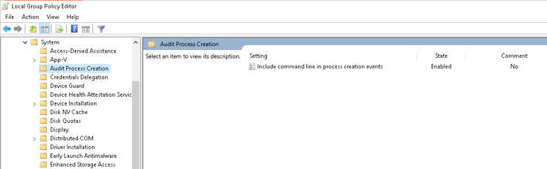
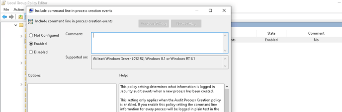

  
Windows displays its event logs in the Windows Event Viewer. This application lets you view and navigate the Windows Event Logs, search and filter on particular types of logs, export them for analysis, and more.

This article has been written for integration with 32 bit and 64 bit Windows machines.

## **Include command line logging in process creation events**

This policy setting determines what information is logged in security audit events when a new process has been created.

This setting only applies when the Audit Process Creation policy is enabled. If you enable this policy setting the command line information for every process will be logged in plain text in the security event log as part of the Audit Process Creation event 4688, "a new process has been created," on the workstations and servers on which this policy setting is applied.

Open the **Local Group Policy Editor** and navigate to **Computer Configuration** > **Administrative Templates** > **System** > **Audit Process Creation** and **Enable the Include command line in process creation events** policy.





  
For more information and latest update, kindly refer the Windows OEM guide - [Command Line Logging](https://learn.microsoft.com/en-us/windows-server/identity/ad-ds/manage/component-updates/command-line-process-auditing#in-order-to-see-the-additions-to-event-id-4688-you-must-enable-the-new-policy-setting-include-command-line-in-process-creation-events)

## **Download and Install Nxlog for Log Forwarding**

- Download and install the latest version of [NXLog](https://nxlog.co/products/nxlog-community-edition/download) on the Windows machine from which the logs need to be collected.

- After installation, locate the **nxlog.conf** file in the **C:\\Program Files (x86)\\nxlog\\conf** folder or C:\\**Program Files\\nxlog\\conf** for 64 bit systems.

- Open the **nxlog.conf** file using a text editor and append the below text:

```
#############windows event logs###############<Extension _json>Module xm_json</Extension><Input in>Module im_msvistalog</Input><Output out>Module om_udpHost DNIF-PICO-IPPort 514Exec to_json();</Output><Route 1>Path in => out</Route>
```

_Note: In the above configuration, replace the text \`DNIF-PICO-IP\` with the Destination IP Address (IP Address of PICO)._

- To apply changes made on nxlog.conf, you have to restart the service again. Go to **Control Panel > Services** and locate the **nxlog** service.  
    Right click on **nxlog** and **restart**  
      
    


  
Windows event logs are now streamed to DNIF.
