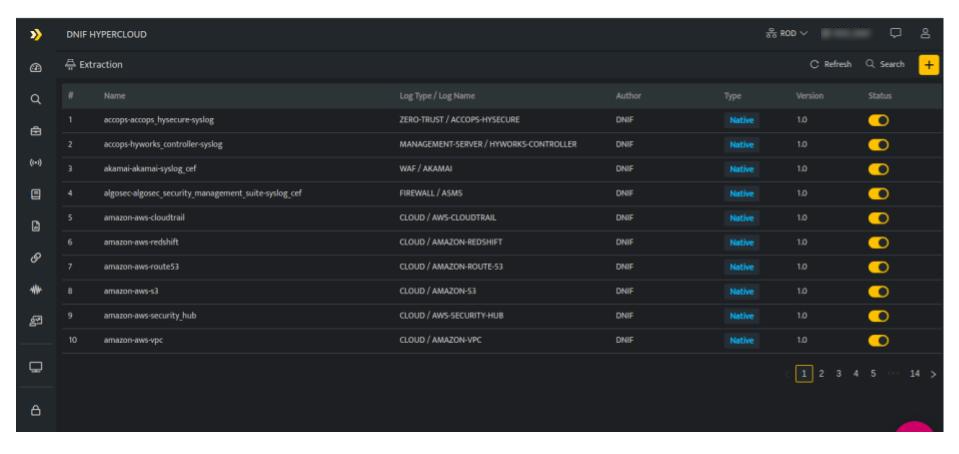
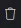

  
DNIF library has extractors ready to ingest data from all types of devices including IT infrastructure like networking equipment, servers and laptops as well as Applications such as Internal Portals, Email, Document Storage. Ingested logs are parsed to extract relevant fields, enriched with additional context and stored in the Datanode. A standard domain-specific extensible schema is applied during ingestion to help you organize your data to build and maintain quality analytics across the enterprise. 

###### **How to view Extractors?**

- Hover on the **System** icon on the left navigation panel and select **Extraction**, the following page will be displayed.  
    

The above page displays the following details.

| **Field**  | **Description** |
| --- | --- |
| Name | Displays the name of the extractor |
| Log Name | Displays the specific log type and log name of this particular extractor |
| Author | Displays the email address of the user who created this extractor. |
| Type | Displays the type of extractor, whether it is a custom / native extractor. |
| Version | Displays the version number of the extractor. |
|  | Allows you to delete the extractor, this will be displayed only for custom extractors |
|  | Click this to refresh the extractor list |
|  | Click this to search for a particular extractor |
|  | Click this to add a new extractor |

Introduced in v9.1.1

UNET sync is a process that is running on core and it automatically syncs your extractors every 30 minutes.
