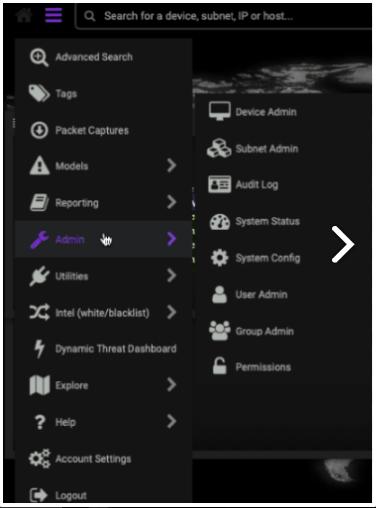
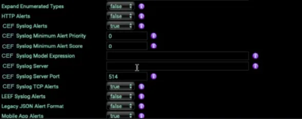

This article describes the steps to configure syslog forwarding for Darktrace.

## **Prerequisites**

- Configure Darktrace to send logs.

- Ensure you are a Darktrace Administrator with access to the User Interface.

## **To configure syslog forwarding for Darktrace:**

1. Log in to the **Darktrace** interface.

3. Expand the top left menu and select **Admin**. A second menu appears.

5. Select the **System Config** page.  
      
      
      
    

7. In the **Alerting** section, click **Verify Alert Settings**.

9. Set the following parameters:
    - **CEF Syslog Alerts** as **True**.
    
    - The **syslog server** to the **IP address of the DNIF Adapter**.
    
    - Set a **unique port.**
    
    - **CEF Syslog TCP Alerts** as **True**.  
          
          
          
        

11. Darktrace will automatically save your changes.

13. In the **Alerting** section, click **Verify Alert Settings**.  
      
      
      
    

15. You will view **1 Alert Sent. IMAP settings are valid** message, on validating.
